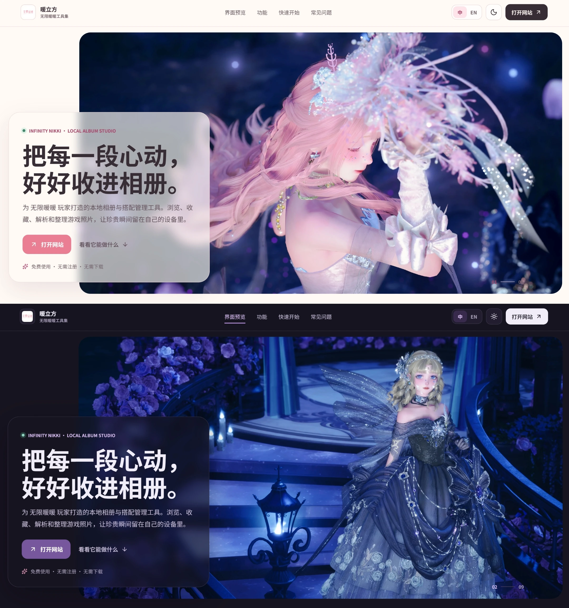
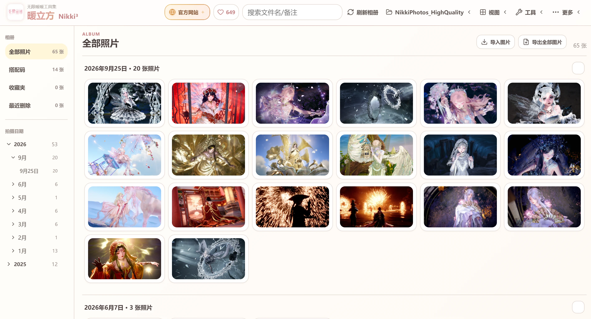
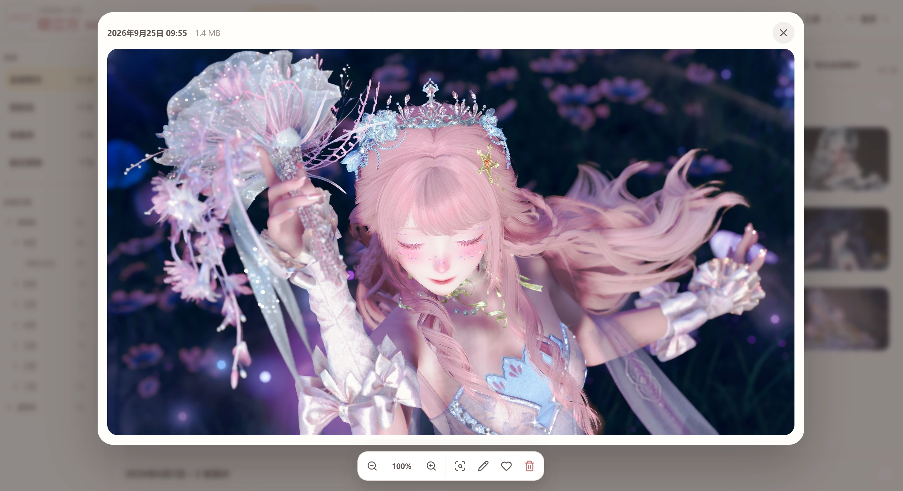
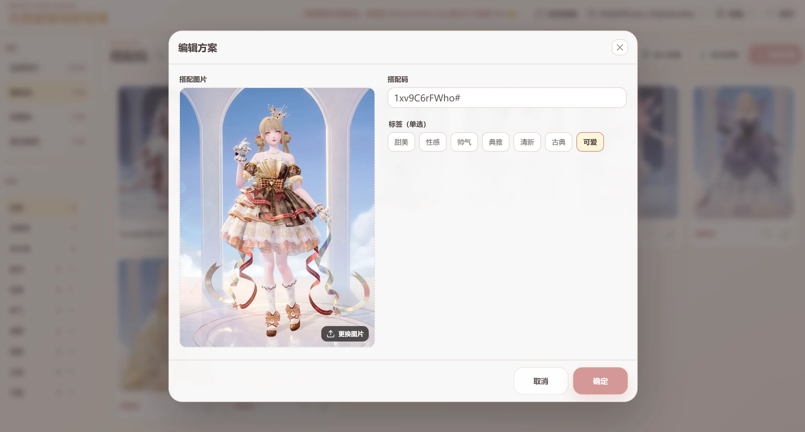
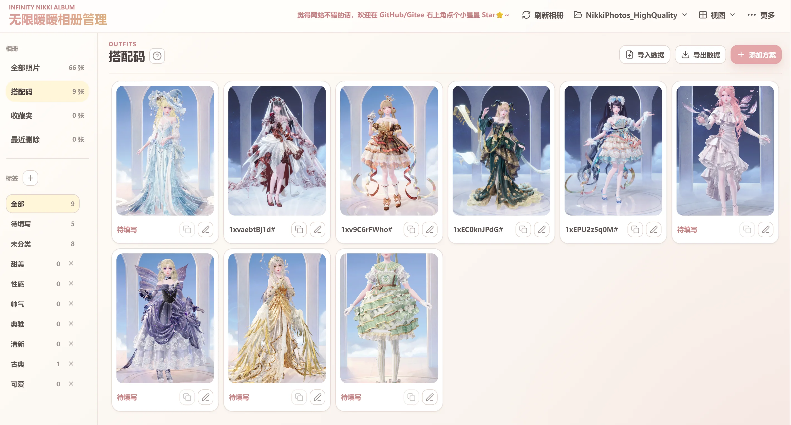
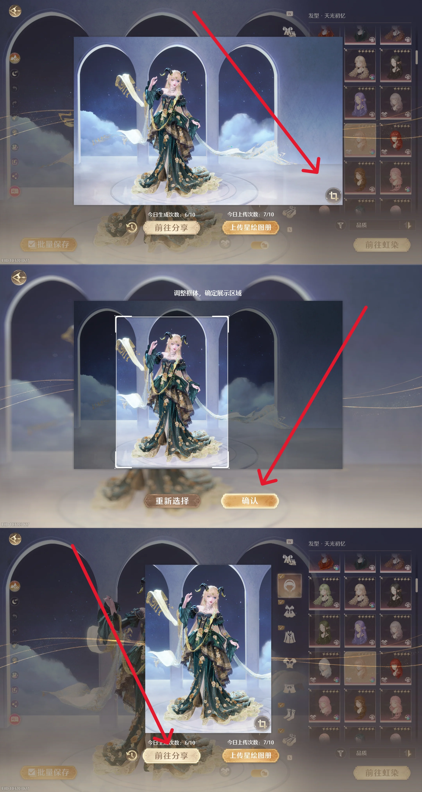

# 无限暖暖相册管理

<div align="center">
  
  <p><strong>在浏览器中整理、浏览、收藏和清理《无限暖暖》本地相册。</strong></p>
  <p style="color: orange;">如果遇到问题，请及时在网站内问题反馈处填写问卷，或在 GitHub / Gitee 的 Issues 或作者社交平台反馈。</p>
  <p>
    <a href="https://github.com/sumopenny/Infinity-Nikki-Album-Manager/releases">GitHub Releases</a> ·
    <a href="https://gitee.com/sumopenny/Infinity-Nikki-Album-Manager/releases">Gitee Releases</a> ·
    <a href="https://github.com/sumopenny/Infinity-Nikki-Album-Manager">GitHub</a> ·
    <a href="https://gitee.com/sumopenny/Infinity-Nikki-Album-Manager">Gitee</a>
  </p>
  <p><a href="README_EN.md"><strong>English</strong></a></p>
</div>

---
### 使用可以直接打开网站：https://infinity-nikki-album-manager.pages.dev/ 。
### 或者访问 Vercel （需要VPN）：https://infinity-nikki-album-manager.vercel.app 。

> 本地部署运行时再下载压缩包或clone项目。点击跳转本地部署教程：[开发者本地运行](#开发者本地运行)

---
## 网站界面
<div align="center">
  
  
  
  
  
 
</div>


## 功能

- 按“年份 > 月份 > 日期”分组，支持折叠时间轴和日期快速跳转。
- 通过“更多”菜单的“问题反馈”入口直接反馈问题。
- “关于网站”窗口提供当前版本和历史版本更新记录。
- 单击选择后从页面底部显示操作栏。
- 双击打开大图预览，支持 50%–300% 缩放、滚轮缩放和放大后拖动。
- 支持键盘翻页和删除当前预览照片。
- 提供 1:1、半尺寸 1:1、16:9、4:3、9:16、3:4 缩略图比例。
- 在本地保存搭配图片、搭配码和标签，支持待填写方案、自动接收图片以及 ZIP 导入导出。
- 通过“专项清理”窗口清理低画质照片与游戏截图、崩溃快照、运行日志和游戏内置浏览器缓存。

## 快速开始

直接打开 https://infinity-nikki-album-manager.pages.dev/ 即可使用，也可通过下载压缩包或 clone 项目来本地运行，点击跳转本地部署教程：[开发者本地运行](#开发者本地运行)。

> 如果国内直连地址临时不可用，可尝试 Vercel 备选地址（需要外网环境）：https://infinity-nikki-album-manager.vercel.app

## 搭配码管理
进入“搭配码”后会显示独立操作指南，请仔细阅读说明。
- 最多可创建 40 个用户标签，每个标签不超过 5 个字符。删除使用中的标签只会让相关方案归入“未分类”。
- 新增标签会显示在标签列表首位；可拖动左侧手柄调整顺序。
- 点击“添加方案”可以选择、拖拽或粘贴图片（点击窗口空白处后按 `Ctrl+V`）；JPG 和 PNG 会在本地转换为 WebP，搭配码允许留空，标签最多选择一个，双击图片可打开预览。
- 搭配方案大图预览的底部工具栏会显示当前标签和搭配码，并提供复制与编辑按钮。
- 网站会在当前相册中按需创建 `clothe` 文件夹来管理搭配码。<span style="color: red;">批量导入时可直接把保存好的搭配图片移动进该文件夹，回到网站页面时会自动转为待填写方案。</span>
- 使用<span style="color: orange;">自动更新搭配码</span>功能需要授权当前游戏的 `X6Game` 文件夹，可前往页面右上角当前相册下拉菜单进行授权。<span style="color: red;">使用方式是：在游戏内点击分享按钮，需要在搭配截图右下角点击框选按钮，框选完成后点击生成搭配码，再返回网页，网站会自动获取搭配码和图片，已有相同搭配码会跳过。</span>

<div align="center">
  
</div>

- “导出数据”会在当前选择的相册文件夹中生成 ZIP 数据文件。“导入数据”不会覆盖已有方案，重复或无效内容会跳过。
- 单击搭配方案可进行多选并显示底部工具栏，<span style="color: red;">搭配方案删除后不可恢复，确认前请核对方案信息。</span>

## 专项清理

点击右上角“专项清理”按钮打开清理窗口，使用清理功能需要授权 `X6Game` 文件夹。

支持以下清理项：

- 低画质图片和截图（`...\X6Game\ScreenShot` 与 `NikkiPhotos_LowQuality`）：游戏拍照后产生的画质较低的图片，仅删除图片文件。存在多个账号文件夹时，可选择清理全部账号或指定账号 ID。
- 游戏崩溃时的快照信息（`...\X6Game\Saved\Crashes`）：删除后将无法通过本地日志向官方反馈历史崩溃原因。
- 游戏运行日志（`...\X6Game\Saved\Logs`）：删除后无影响。
- 游戏内置浏览器与登录器缓存（`...\X6Game\Saved\webcache_4430`）：清理过期网页数据，但初次打开活动页面或公告时会加载变慢。

## 选择相册

点击“选择/恢复相册路径”，推荐直接选择：

```text
...\InfinityNikki Launcher\InfinityNikki\X6Game\Saved\GamePlayPhotos\你的ID\NikkiPhotos_HighQuality
```

不要选择 C 盘、Program Files、游戏安装根目录等受保护或过大的上级目录。

## 常用操作

| 操作 | 结果 |
| --- | --- |
| 单击照片 | 选中或取消选中 |
| 双击照片 | 打开大图预览 |
| 点击爱心 | 加入或移出收藏夹 |
| 点击左侧日期 | 跳转到对应日期 |
| 左右方向键 | 在大图预览中切换照片 |
| 滚轮 / 缩放按钮 | 在大图预览中按 25% 步长缩放 |
| 拖动大图 | 放大后移动图片查看细节 |
| `Esc` | 关闭大图预览 |
| `Delete` | 将当前预览照片移到最近删除 |
| 底部操作栏 | 全选、批量收藏、删除、恢复或永久删除 |

> 普通相册删除会把原图移动到当前相册的 `trash` 文件夹；<span style="color: red;">最近删除中的“永久删除”和“专项清理”会直接删除电脑文件，无法恢复。</span>


## 常见问题

### 启动器没有反应

- 确认项目已经完整解压，不要在 ZIP 内运行。
- 确认已安装 Node.js LTS，且 `start` 文件夹没有缺失。
- 检查安全软件是否拦截 EXE 或 BAT 文件。
- 也可直接运行 `start\Start-Project.bat` 查看错误信息。

### 网页没有显示照片

- 确认选择的是实际图片目录。
- 确认文件扩展名受支持；文件名以日期格式开头时会优先按文件名整理，其他图片会按文件最后修改时间显示。
- 浏览器授权失效时，重新点击“选择/恢复相册路径”。

### 浏览器拒绝打开文件夹

浏览器会阻止网页访问系统目录。请直接选择 `NikkiPhotos_HighQuality`，<span style="color: red;">不要选择磁盘根目录或游戏安装上级目录。</span>

## 隐私与安全

- 照片在本地浏览器中读取。
- 相册目录授权和收藏记录保存在当前浏览器本地；“更多”里的“清除缓存”只清除 `X6Game` 授权和搭配码指南“不再提示”状态并保留当前相册授权，“清除数据”会二次确认后清除全部网站本地记录和授权，让网站回到首次打开状态。
- 浏览器可能因安全策略要求重新授权文件夹。
- 删除和专项清理会修改电脑中的真实文件；“清除缓存”和“清除数据”不会删除电脑里的文件。

## 本地安装


环境要求：Windows、[Node.js LTS](https://nodejs.org/)、电脑上的最新版 Chrome、Edge 或其他兼容的 Chromium 浏览器。

### 安装 Node.js

1. 打开 [Node.js 官网](https://nodejs.org/)，下载标有 **LTS** 的 Windows 安装包，不要选择 Current 版本。
2. 双击安装包，保持默认选项并继续安装；确保 `Add to PATH` 相关选项没有被取消。
3. 安装完成后关闭并重新打开终端、项目文件夹和启动器窗口，让环境变量生效。
4. 按 `Win + R`，输入 `cmd` 并回车，然后分别运行：

```bash
node -v
npm -v
```

两个命令都能显示版本号，说明安装成功。如果提示“不是内部或外部命令”，请重启电脑后再试；仍然失败时，卸载 Node.js 并重新安装 LTS 版本。

### 本地部署

1. 从 [GitHub Releases](https://github.com/sumopenny/Infinity-Nikki-Album-Manager/releases) 或 [Gitee Releases](https://gitee.com/sumopenny/Infinity-Nikki-Album-Manager/releases) 下载并解压项目，或从仓库克隆源码。
2. 双击根目录的 `无限暖暖相册启动器.exe`。
3. 首次运行会自动安装依赖并打开 `http://localhost:5173`。
4. 使用期间不要关闭窗口。

启动器不可用时，可双击 `start\Start-Project.bat`，或使用下方开发命令手动启动。

### 开发命令

```bash
npm install       # 安装依赖
npm run dev       # 启动开发服务器
npm test          # 运行自动化测试
npm run build     # 类型检查并构建
npm run preview   # 预览构建结果
```

技术栈：Vue 3、TypeScript、Vite、File System Access API、IndexedDB。

---

如果这个项目对你有帮助，欢迎在 [GitHub](https://github.com/sumopenny/Infinity-Nikki-Album-Manager) 或者 [Gitee](https://gitee.com/sumopenny/Infinity-Nikki-Album-Manager) 里点一个 Star。

---

## 打赏支持

作者为爱发电，网站制作不易，觉得好用的话可以来支持我~

<div align="center">
  
  
</div>
