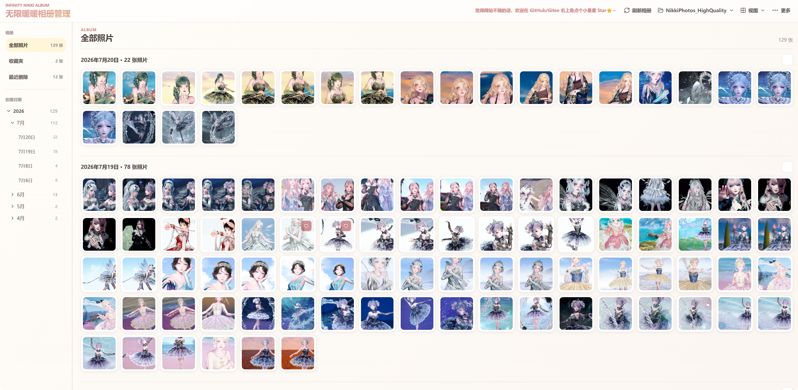
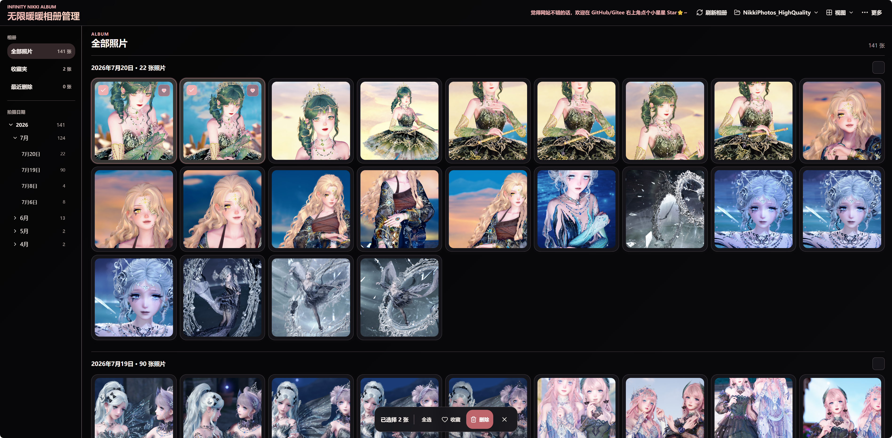
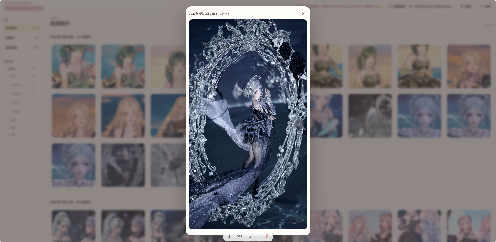
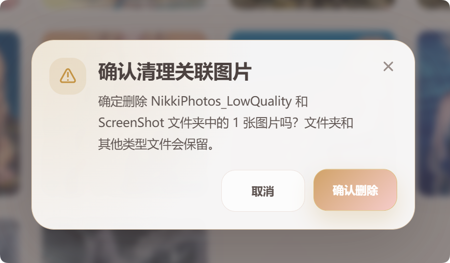

# Infinity Nikki Album Manager / 无限暖暖相册管理

<div align="center">
  
  <p><strong>在浏览器中整理、浏览、收藏和清理《无限暖暖》本地相册。</strong></p>
  <p>Browse, organize, favorite, preview, and clean local Infinity Nikki albums.</p>
  <p>
    <a href="https://infinity-nikki-album-manager.vercel.app">在线使用（需要vpn）</a> ·
    <a href="https://github.com/sumopenny/Infinity-Nikki-Album-Manager/releases">GitHub Releases</a> ·
    <a href="https://gitee.com/sumopenny/Infinity-Nikki-Album-Manager/releases">Gitee Releases</a> ·
    <a href="https://github.com/sumopenny/Infinity-Nikki-Album-Manager">GitHub</a> ·
    <a href="https://gitee.com/sumopenny/Infinity-Nikki-Album-Manager">Gitee</a>
  </p>
</div>

> 新版本、更新内容和下载文件：[GitHub Releases](https://github.com/sumopenny/Infinity-Nikki-Album-Manager/releases) · [Gitee Releases](https://gitee.com/sumopenny/Infinity-Nikki-Album-Manager/releases)

<div align="center">
  <a href="#简体中文"><strong>简体中文</strong></a> ·
  <a href="#english"><strong>English</strong></a>
</div>


---
> 网站界面
<div align="center">
  
  
  
  
</div>

## 简体中文

### 功能

- 按“年份 > 月份 > 日期”分组，支持折叠时间轴和日期快速跳转。
- 使用“全部照片 / 收藏夹 / 最近删除”三个独立入口管理照片。
- 顶部通过“当前相册 / 视图 / 更多”菜单集中管理目录、主题、缩略图、语言、帮助和项目链接。
- 手动刷新相册，并在页面重新获得焦点时自动发现新增或外部删除的照片。
- 删除的高画质照片会移动到当前相册的 `trash` 文件夹，可预览、恢复或永久删除。
- 单击选择后从页面底部显示批量收藏、删除、恢复或永久删除操作栏。
- 双击打开大图预览，支持 50%–300% 缩放、滚轮缩放和放大后拖动。
- 支持键盘翻页和删除当前预览照片。
- 提供 1:1、半尺寸 1:1、16:9、4:3、9:16、3:4 缩略图比例；半尺寸模式的悬浮信息只显示拍摄时间。
- 记住相册目录和收藏状态，支持中英文与亮暗主题。
- 一键清理同账号的低画质照片与游戏截图。


### 快速开始

#### 在线使用（需要VPN）

打开 [vercel在线版本](https://infinity-nikki-album-manager.vercel.app)

#### Windows 本地启动

环境要求：Windows、[Node.js LTS](https://nodejs.org/)、最新版 Chrome 或 Edge。

#### 安装 Node.js

1. 打开 [Node.js 官网](https://nodejs.org/)，下载标有 **LTS** 的 Windows 安装包，不要选择 Current 版本。
2. 双击安装包，保持默认选项并继续安装；确保 `Add to PATH` 相关选项没有被取消。
3. 安装完成后关闭并重新打开终端、项目文件夹和启动器窗口，让环境变量生效。
4. 按 `Win + R`，输入 `cmd` 并回车，然后分别运行：

```bash
node -v
npm -v
```

两个命令都能显示版本号，说明安装成功。如果提示“不是内部或外部命令”，请重启电脑后再试；仍然失败时，卸载 Node.js 并重新安装 LTS 版本。

#### 启动项目

1. 从 [GitHub Releases](https://github.com/sumopenny/Infinity-Nikki-Album-Manager/releases) 或 [Gitee Releases](https://gitee.com/sumopenny/Infinity-Nikki-Album-Manager/releases) 下载并解压项目。
2. 双击根目录的 `无限暖暖相册启动器.exe`。
3. 首次运行会自动安装依赖并打开 `http://localhost:5173`。
4. 使用期间不要关闭窗口。

启动器不可用时，可双击 `start\Start-Project.bat`，或使用下方开发命令手动启动。

### 选择相册

点击“选择/恢复相册路径”，推荐直接选择：

```text
...\InfinityNikki Launcher\InfinityNikki\X6Game\Saved\GamePlayPhotos\你的ID\NikkiPhotos_HighQuality
```

不要选择 C 盘、Windows、Program Files、游戏安装根目录等受保护或过大的上级目录。

照片文件名需要以日期开头，例如：

```text
2026_06_26_11_22_58_6316602.jpeg
```

支持格式：`jpg`、`jpeg`、`png`、`webp`、`gif`、`bmp`、`avif`。

### 常用操作

| 操作 | 结果 |
| --- | --- |
| 单击照片 | 选中或取消选中 |
| 双击照片 | 打开大图预览 |
| 点击爱心 | 加入或移出收藏夹 |
| 点击左侧日期 | 跳转到对应日期 |
| 左右方向键 | 在大图预览中切换照片 |
| 滚轮 / 缩放按钮 | 在大图预览中按 25% 步长缩放 |
| 拖动大图 | 放大后移动图片查看细节 |
| `Esc` | 关闭大图预览 |
| `Delete` | 将当前预览照片移到最近删除 |
| 底部操作栏 | 全选、批量收藏、删除、恢复或永久删除 |

> 普通相册删除会把原图移动到当前相册的 `trash` 文件夹；最近删除中的“永久删除”和“一键清理低画质与截图”会直接删除电脑文件，无法恢复。

### 最近删除与刷新

- 点击“刷新相册”可立即同步目录；页面重新获得焦点时也会自动同步，并提示新增和外部移除数量。
- 最近删除按删除时间倒序展示，顶部显示照片总数和总大小。
- 支持单张或批量恢复、永久删除、全选、大图预览和永久清空全部。
- 恢复时如果原相册已有同名文件，会自动使用 `_restored_1`、`_restored_2` 等后缀，不会覆盖现有照片。
- 最近删除中的照片不会自动过期，会一直保留到恢复或手动永久删除。

### 一键清理低画质与截图

选择 `NikkiPhotos_HighQuality` 后，点击“一键清理低画质与截图”，可清理：

- `NikkiPhotos_LowQuality` 中的图片。
- 当前游戏 `X6Game\ScreenShot` 中的图片。

首次使用需要额外选择并授权对应的 `X6Game` 文件夹。程序会验证相册路径，删除前显示数量并再次确认；只删除图片，保留文件夹和其他文件。完成后会显示实际清理数量和释放容量；无法读取或删除的文件会保留并列出具体原因。



### 常见问题

#### 启动器没有反应

- 确认项目已经完整解压，不要在 ZIP 内运行。
- 确认已安装 Node.js LTS，且 `start` 文件夹没有缺失。
- 检查安全软件是否拦截 EXE 或 BAT 文件。
- 也可直接运行 `start\Start-Project.bat` 查看错误信息。

#### 网页没有显示照片

- 确认选择的是实际图片目录。
- 确认文件扩展名受支持，且文件名以日期格式开头。
- 浏览器授权失效时，重新点击“选择/恢复相册路径”。

#### 浏览器拒绝打开文件夹

Chrome 和 Edge 会阻止网页访问系统目录。请直接选择 `NikkiPhotos_HighQuality`，不要选择磁盘根目录或游戏安装上级目录。

### 开发命令

```bash
npm install       # 安装依赖
npm run dev       # 启动开发服务器
npm test          # 运行自动化测试
npm run build     # 类型检查并构建
npm run preview   # 预览构建结果
```

技术栈：Vue 3、TypeScript、Vite、File System Access API、IndexedDB。

### 隐私与安全

- 照片在本地浏览器中读取，不会上传到项目服务器。
- 相册目录授权和收藏记录保存在当前浏览器本地。
- 浏览器可能因安全策略要求重新授权文件夹。
- 删除和一键清理会修改电脑中的真实文件，请确认后操作。

---

## English

### Features

- Group photos by year, month, and date with a collapsible timeline and quick date jumps.
- Favorite photos and browse Favorites separately.
- Use separate All photos, Favorites, and Recently deleted views.
- Use the Current album, View, and More menus for folders, themes, thumbnails, language, help, and project links.
- Refresh manually or let the app detect new and externally removed photos when the page regains focus.
- Deleted high-quality photos move to the album's `trash` folder for preview, restore, or permanent deletion.
- Select photos to reveal a fixed bottom bar for batch favorite, delete, restore, or permanent deletion.
- Double-click for a large preview with 50%–300% zoom, wheel zooming, and drag-to-pan.
- Navigate previews with the keyboard and delete the current photo.
- Choose 1:1, Half 1:1, 16:9, 4:3, 9:16, or 3:4 thumbnails; Half 1:1 hover metadata shows capture time only.
- Remember album access and Favorites; includes Chinese/English and light/dark themes.
- Clean low-quality photos and game screenshots with one action.

### Quick Start

#### Online (VPN Required)

Open the [Vercel online version](https://infinity-nikki-album-manager.vercel.app).

#### Windows Local Setup

Requirements: Windows, [Node.js LTS](https://nodejs.org/), and the latest Chrome or Edge.

#### Install Node.js

1. Open the [Node.js website](https://nodejs.org/) and download the Windows installer marked **LTS**, not Current.
2. Run the installer with the default options and keep the option that adds Node.js to `PATH` enabled.
3. Close and reopen terminals, project folders, and launcher windows after installation so the updated environment is loaded.
4. Press `Win + R`, enter `cmd`, and run:

```bash
node -v
npm -v
```

Both commands should print a version number. If Windows reports that either command is not recognized, restart the computer and try again. If it still fails, uninstall Node.js and reinstall the LTS version.

#### Start the Project

1. Download and extract the project from [GitHub Releases](https://github.com/sumopenny/Infinity-Nikki-Album-Manager/releases) or [Gitee Releases](https://gitee.com/sumopenny/Infinity-Nikki-Album-Manager/releases).
2. Double-click `无限暖暖相册启动器.exe` in the project root.
3. On first run, dependencies are installed automatically and `http://localhost:5173` opens.
4. Keep the launcher window open while using the app.

If the launcher fails, run `start\Start-Project.bat` or use the development commands below.

### Choose an Album

Click `Choose / restore album folder` and select the actual image folder:

```text
...\InfinityNikki Launcher\InfinityNikki\X6Game\Saved\GamePlayPhotos\Your ID\NikkiPhotos_HighQuality
```

Do not select drive roots, Windows, Program Files, the game root, or other protected parent directories.

Photo filenames must start with a date, for example:

```text
2026_06_26_11_22_58_6316602.jpeg
```

Supported formats: `jpg`, `jpeg`, `png`, `webp`, `gif`, `bmp`, `avif`.

### Controls

| Action | Result |
| --- | --- |
| Single-click | Select or unselect a photo |
| Double-click | Open large preview |
| Click the heart | Add to or remove from Favorites |
| Click a sidebar date | Jump to that date |
| Left / Right Arrow | Navigate the large preview |
| Mouse wheel / zoom buttons | Zoom the preview in 25% steps |
| Drag the preview | Pan a zoomed photo |
| `Esc` | Close the preview |
| `Delete` | Move the current preview photo to Recently deleted |
| Bottom action bar | Select all, favorite, delete, restore, or permanently delete |

> Normal album deletion moves the original into the album's `trash` folder. Permanent deletion in Recently deleted and low-quality/screenshot cleanup remove computer files and cannot be undone.

### Recently Deleted and Refresh

- Use `Refresh album` to sync immediately. The app also syncs when the page regains focus and reports new or externally removed photos.
- Recently deleted photos are sorted by deletion time, with total count and size shown above the grid.
- Restore or permanently delete individual or selected photos, select all, preview full-size images, or permanently clear everything.
- When restoring conflicts with an existing filename, `_restored_1`, `_restored_2`, and later suffixes are used without overwriting files.
- Recently deleted photos do not expire automatically. They remain until restored or permanently deleted manually.

### Clean Low-quality Photos and Screenshots

After selecting `NikkiPhotos_HighQuality`, use `Clean low-quality & screenshots` to remove images from:

- `NikkiPhotos_LowQuality` for the same account.
- The current game's `X6Game\ScreenShot` folder.

On first use, select and authorize the matching `X6Game` folder. The app validates the album path, displays the number of files, and asks for confirmation before deletion. Only image files are removed; folders and other file types remain. The result reports the actual released capacity and keeps unreadable or undeletable files with a clear failure reason.


### FAQ

#### The launcher does nothing

- Extract the complete ZIP before running it.
- Install Node.js LTS and make sure the `start` folder exists.
- Check whether security software blocked the EXE or BAT file.
- Run `start\Start-Project.bat` directly to see error details.

#### No photos are displayed

- Select the actual image folder.
- Check the file extension and filename date format.
- If folder access expired, click `Choose / restore album folder` again.

#### The browser refuses to open a folder

Chrome and Edge block access to protected system folders. Select `NikkiPhotos_HighQuality` directly instead of a drive root or high-level game directory.

### Development

```bash
npm install       # Install dependencies
npm run dev       # Start the development server
npm test          # Run automated tests
npm run build     # Type-check and build
npm run preview   # Preview the production build
```

Stack: Vue 3, TypeScript, Vite, File System Access API, IndexedDB.

### Privacy and Safety

- Photos are read locally in your browser and are not uploaded to the project server.
- Folder access and Favorites are stored in the current browser.
- Browser security policies may require folder authorization again.
- Delete and cleanup actions modify real files on your computer.

---

If this project helps you, consider giving it a Star on [GitHub](https://github.com/sumopenny/Infinity-Nikki-Album-Manager).
