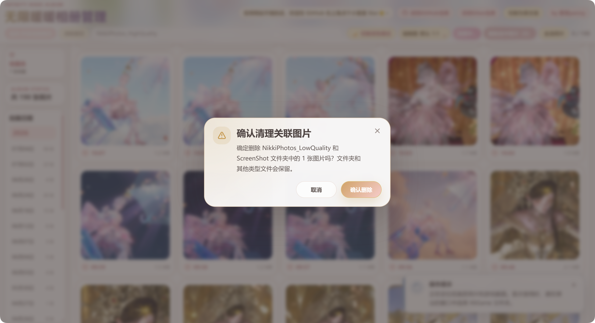
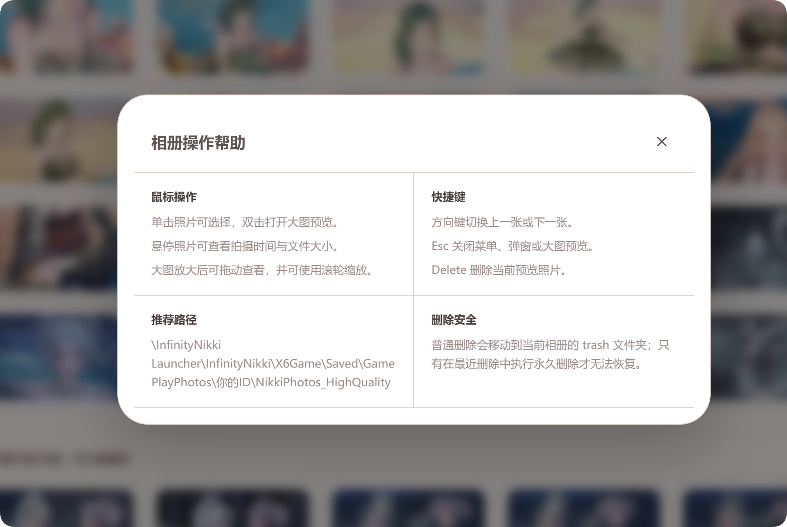
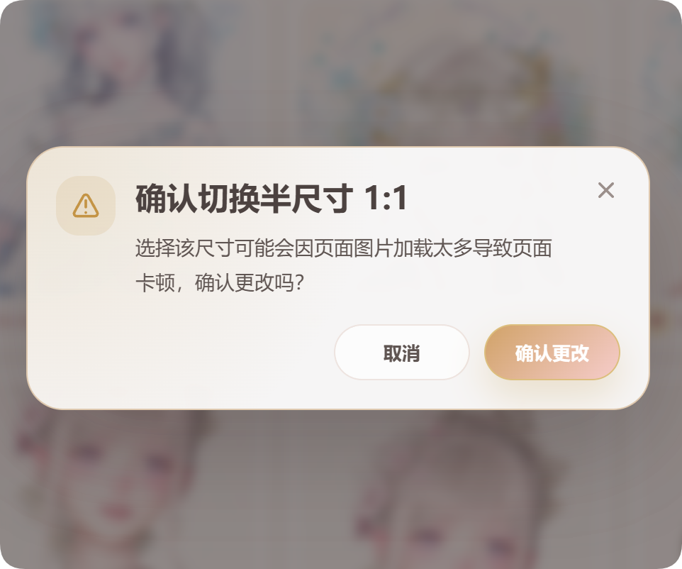

# Infinity Nikki Album Manager / 无限暖暖相册管理

<div align="center">
  
  <br>
  <em>一个用于整理、浏览、收藏和删除《无限暖暖》相册的本地网页工具。</em>
  <br>
  <em>A local web tool for browsing, organizing, favoriting, previewing, and deleting Infinity Nikki albums.</em>
</div>

## 使用方式 / How to Use

本项目已经部署到 Vercel，可以直接访问（需要VPN）：[https://infinity-nikki-album-manager.vercel.app](https://infinity-nikki-album-manager.vercel.app)

如果你觉得这个网站不错，欢迎在 GitHub 页面右上角点一个小星星 Star 支持一下。

This project has been deployed on Vercel. You can visit it directly (requires VPN): [https://infinity-nikki-album-manager.vercel.app](https://infinity-nikki-album-manager.vercel.app)

If you like this website, please give it a Star in the upper-right corner of the GitHub page.

<div align="center">
  <a href="#简体中文教程"><b>🇨🇳 简体中文</b></a> &nbsp;&nbsp;|&nbsp;&nbsp;
  <a href="#english-guide"><b>🇺🇸 English</b></a>
</div>


---

## 简体中文教程

### 1. 这个项目是做什么的？

这个项目可以在浏览器里打开一个相册管理页面，用来管理《无限暖暖》的相册文件夹，并支持按拍摄日期浏览、收藏喜欢的照片和删除不需要的原图。


你可以用它做这些事：

- 选择电脑里的《无限暖暖》相册文件夹，推荐文件路径：文件所在盘和目录\InfinityNikki Launcher\InfinityNikki\X6Game\Saved\GamePlayPhotos\你的id\NikkiPhotos_HighQuality。


- <a href="#67-一键清理低画质与截图"><b>一键清理NikkiPhotos_LowQuality和ScreenShot文件夹中的低质量图片</b></a>

- 按拍摄日期自动分组显示照片。
- 点击日期快速跳转到某一天的照片。
- 点击照片时间前的爱心图标，把喜欢的图片加入收藏夹；点击左侧收藏夹按钮，只展示收藏图片及对应拍摄日期。
- 单击照片进行选中，双击照片查看大图。


- 在大图预览里使用键盘左右方向键翻页。
- 删除选中的照片，或删除当前预览的照片。
- 调整缩略图比例，比如 1:1、半尺寸 1:1、16:9、4:3、9:16、3:4；选择半尺寸 1:1 前会提示页面可能卡顿，需要确认后才会切换。
- 
<div align="center">


</div>
- 浏览器会记住上次选择过的相册文件夹，下次可以尝试自动恢复。
- 收藏夹状态会保存在当前浏览器本地，不会上传图片或收藏记录。

重要提醒：删除照片会同步删除电脑文件夹里的原图，请确认不要的照片再删除。

---

### 2. 使用前需要准备什么？

请先准备下面几样东西。

#### 2.1 一台电脑

这个项目提供了根目录下的 `无限暖暖相册启动器.exe`，双击即可启动。

#### 2.2 Node.js

项目需要 Node.js 才能运行。

如果你的电脑还没有安装 Node.js，请这样做：

1. 打开浏览器。
2. 访问 Node.js 官网：`https://nodejs.org/`
3. 下载 LTS 版本，也就是官网推荐的长期支持版本。
4. 像安装普通软件一样一路下一步安装。
5. 安装完成后，重新打开项目文件夹，再双击 `无限暖暖相册启动器.exe`。

如果双击启动文件时提示 `Node.js was not found` 或 `npm was not found`，一般就是 Node.js 没装好，需要重新安装 Node.js。

#### 2.3 浏览器

本项目需要浏览器支持“选择文件夹”和“读写本地文件”的能力。

---

### 3. 如何从 GitHub/Gitee 下载项目？

如果你不熟悉 Git，也没有关系，按下面步骤操作即可。

#### 方法一：直接下载 ZIP，适合大多数人

1. 打开项目的 GitHub/Gitee 页面。
2. 点击绿色的 `Code` 按钮。
3. 点击 `Download ZIP`。
4. 下载完成后，右键压缩包，选择“全部解压”或“解压到当前文件夹”。
5. 打开解压后的项目文件夹。
6. 找到 `无限暖暖相册启动器.exe` 文件。
7. 双击它。

注意：不要直接在压缩包里面双击运行。一定要先解压，再进入解压后的文件夹运行。

#### 方法二：使用 Git 克隆，适合开发者

如果你会使用 Git，可以运行：

```bash
git clone https://github.com/sumopenny/Infinity-Nikki-Album-Manager.git
cd Infinity-Nikki-Album-Manager
npm install
npm run dev
```

---

### 4. 最简单的启动方式：双击 无限暖暖相册启动器.exe

项目根目录里有一个文件：

```text
无限暖暖相册启动器.exe
```

它会自动调用 `start` 文件夹里的 `Start-Project.bat`。

如果启动器失效，也可以改为双击 `start\Start-Project.bat`。

使用步骤：

1. 打开项目文件夹。
2. 找到 `无限暖暖相册启动器.exe`。
3. 用鼠标左键双击它。
4. 第一次运行时，它会自动执行 `npm install` 安装依赖。
5. 等它安装完成后，会自动启动网站。
6. 浏览器会自动打开这个地址：

```text
http://localhost:5173
```

如果浏览器没有自动打开，请自己打开浏览器，然后把下面这个地址复制到地址栏里：

```text
http://localhost:5173
```

#### 启动时出现的黑色窗口能不能关？

会出现启动器窗口和开发服务窗口。

请记住：

- 启动器窗口完成检查、启动网站并打开浏览器后，会自动关闭。
- 网站使用期间，不要关闭标题为 `Dev Server` 的开发服务窗口。
- 如果关闭了开发服务窗口，网页就会停止运行。
- 如果不小心关掉了，重新双击 `无限暖暖相册启动器.exe` 即可。

---

### 5. 手动启动方式

如果你不想使用 BAT 文件，也可以手动启动。

1. 打开项目文件夹。
2. 在空白处右键，选择“在终端中打开”。
3. 第一次运行时，输入：

```bash
npm install
```

4. 安装完成后，输入：

```bash
npm run dev
```

5. 浏览器打开：

```text
http://localhost:5173
```

---

### 6. 如何使用网页管理相册？

#### 6.1 选择相册文件夹

打开网站后，点击页面上的：

```text
选择/恢复相册路径
```

然后选择《无限暖暖》的截图文件夹。

推荐直接选择图片文件夹，例如：

```text
NikkiPhotos_HighQuality
```

不要选择这些位置：

- C 盘根目录
- Windows 文件夹
- Program Files 文件夹
- 游戏安装根目录的上级目录
- 其他系统保护目录

如果选择了系统保护目录，浏览器可能会拒绝访问。

#### 6.2 图片文件名

项目会根据图片文件名里的日期来分组。

#### 6.3 浏览照片

选择正确的相册文件夹后，页面会显示照片。

常用操作：

- 单击照片：选中或取消选中。
- 点击照片时间前的爱心图标：加入或取消收藏，空心爱心表示未收藏，填充爱心表示已收藏。
- 双击照片：打开大图预览。
- 点击左侧日期：跳转到对应日期。
- 点击左侧收藏夹：只显示收藏的图片，左侧日期同步切换为收藏图片的拍摄日期。
- 点击“全选照片”：选中全部照片。
- 再点一次“取消全选”：取消全部选中。

#### 6.4 使用收藏夹

收藏夹适合临时筛选和整理喜欢的照片。

- 每张照片时间前都有一个爱心图标。
- 点击爱心图标后，照片会加入或移出收藏夹。
- 点击左侧栏上方的“收藏夹”按钮后，图片展示区只显示已收藏照片。
- 收藏夹模式下，左侧日期栏只显示收藏照片对应的拍摄日期。
- 再次点击左侧栏上方的“全部照片”按钮，可以返回完整相册。
- 收藏记录保存在当前浏览器本地；如果清理浏览器数据，收藏记录可能会被清除。

#### 6.5 大图预览

打开大图后可以这样操作：

- 按键盘左方向键：上一张。
- 按键盘右方向键：下一张。
- 按 `Esc`：关闭大图预览。
- 按 `Delete` 或点击删除按钮：删除当前预览的照片。

#### 6.6 删除照片

页面支持删除照片。

可以删除：

- 当前预览的单张照片。
- 已选中的多张照片。

删除前页面会弹出与网页风格一致的自定义确认窗口，请认真确认。

再次提醒：删除操作会删除电脑文件夹里的原图，不只是从网页上移除；如果删除的是收藏照片，它也会自动从收藏夹中移除。

#### 6.7 一键清理低画质与截图

选择 `NikkiPhotos_HighQuality` 相册后，可以点击粉色的“一键清理低画质与截图”按钮，清理同一账号下 `NikkiPhotos_LowQuality` 和当前游戏 `X6Game\ScreenShot` 文件夹中的图片。

- 首次使用或原授权失效时，页面会先弹窗提示选择当前游戏安装目录中的 `X6Game` 文件夹。
- 选择正确的 `X6Game` 文件夹后，浏览器会保存该目录授权；后续点击按钮时可直接定位并清理，不再重复显示选择提示。
- 删除前会显示图片数量并再次确认。
- 清理只删除目标文件夹内的图片，保留文件夹本身和其他类型文件。
- 点击“清除路径”会同时清除已保存的相册路径和 `X6Game` 授权。

---

### 7. 常见问题

#### 问：双击 无限暖暖相册启动器.exe 没反应怎么办？

可以按顺序检查：

1. 项目是不是已经解压出来了？不要在 ZIP 压缩包里运行。
2. 电脑是否安装了 Node.js？
3. `start` 文件夹是否还在项目根目录里？
4. `无限暖暖相册启动器.exe` 和 `start\Start-Project.bat` 是否都存在？
5. 是否有安全软件拦截了快捷方式、EXE 或 BAT 文件？
6. 可以尝试右键 `无限暖暖相册启动器.exe`，选择“以管理员身份运行”。

#### 问：提示 npm install 失败怎么办？

一般是网络问题或 Node.js 安装不完整。

可以尝试：

1. 检查网络连接。
2. 重新安装 Node.js LTS。
3. 在项目文件夹打开终端，手动运行：

```bash
npm install
```

#### 问：网页打不开怎么办？

先确认开发服务窗口还开着。

如果窗口还在，请手动打开：

```text
http://localhost:5173
```

如果提示端口被占用，可以关闭其他正在运行的项目窗口，然后重新双击 `无限暖暖相册启动器.exe`。

#### 问：为什么浏览器不让我选择某个文件夹？

浏览器为了保护电脑，不允许网页访问系统文件夹或受保护目录。

请直接选择真正存放图片的文件夹，比如 `NikkiPhotos_HighQuality`，不要选择 C 盘、Windows、Program Files 这类上级目录。

#### 问：为什么没有显示照片？

可能原因：

1. 选错文件夹。
2. 文件夹里没有图片。
3. 图片扩展名不在支持范围内。
4. 文件名开头没有日期格式。

支持的图片扩展名包括：

```text
jpg, jpeg, png, webp, gif, bmp, avif
```

#### 问：为什么下次打开还要授权？

浏览器会尽量记住上次选择的文件夹，但出于安全原因，有时仍然需要你重新授权。

如果看到授权提示，请再次点击“选择/恢复相册路径”。

---

### 8. 开发者命令

安装依赖：

```bash
npm install
```

启动开发服务器：

```bash
npm run dev
```

打包项目：

```bash
npm run build
```

预览打包结果：

```bash
npm run preview
```

---

### 9. 项目结构说明

```text
.
├─ 无限暖暖相册启动器.exe    # Windows 一键启动程序
├─ start/                   # 启动器文件目录
│  ├─ Start-Project.bat     # Windows 启动脚本，负责检查依赖并启动本地网站
│  └─ launcher/             # 启动器源码和构建脚本
├─ index.html               # 网页入口
├─ package.json             # 项目信息和 npm 命令
├─ src/                     # 源代码目录
│  ├─ App.vue               # 主页面逻辑
│  ├─ main.ts               # Vue 入口
│  ├─ styles.css            # 全局样式
│  ├─ components/           # 页面组件
│  ├─ types/                # TypeScript 类型
│  └─ utils/                # 工具函数
└─ vite.config.ts           # Vite 配置
```

---

## English Guide

### 1. What is this project?

Infinity Nikki Album Manager is a local web app for managing Infinity Nikki screenshot folders in your browser, including date browsing, favorites, previews, and local file deletion.


You can use it to:

- Choose your local Infinity Nikki screenshot folder. Recommended path: `drive and directory\InfinityNikki Launcher\InfinityNikki\X6Game\Saved\GamePlayPhotos\your id\NikkiPhotos_HighQuality`.

- <a href="#67-clean-low-quality-photos-and-screenshots"><b>Clean low-quality images from NikkiPhotos_LowQuality and ScreenShot with one click</b></a>

- Automatically group photos by date.
- Jump to a specific date from the sidebar.
- Click the heart icon before each photo time to add it to Favorites, then click the left Favorites button to show only favorite photos and their capture dates.
- Single-click photos to select them.
- Double-click photos to preview them in a larger view.

- Use keyboard shortcuts in the preview window.
- Delete selected photos or delete the photo currently being previewed.
- Change thumbnail ratios, including 1:1, Half 1:1, 16:9, 4:3, 9:16, and 3:4; Half 1:1 shows a lag warning and requires confirmation before switching.
<div align="center">


</div>
- Let the browser remember the last selected album folder when possible.
- Save Favorites locally in the current browser without uploading photos or favorite records.

Important: deleting a photo in this app also deletes the original file from your computer folder.

---

### 2. What do you need before using it?

Please prepare the following items first.

#### 2.1 A computer

This project includes the root-level `无限暖暖相册启动器.exe` launcher. Double-click it to start the project.

#### 2.2 Node.js

This project needs Node.js to run.

If Node.js is not installed:

1. Open your browser.
2. Visit the Node.js website: `https://nodejs.org/`
3. Download the LTS version.
4. Install it like a normal program.
5. After installation, open the project folder again and double-click `无限暖暖相册启动器.exe`.

If the launcher says `Node.js was not found` or `npm was not found`, Node.js is missing or not installed correctly.

#### 2.3 A browser

This project needs a browser that supports folder selection and local file read/write access.

---

### 3. How to download the project from GitHub/Gitee

If you are not familiar with Git, use the ZIP download method.

#### Method 1: Download ZIP, recommended for most users

1. Open the project's GitHub/Gitee page.
2. Click the green `Code` button.
3. Click `Download ZIP`.
4. After downloading, right-click the ZIP file and choose `Extract All` or extract it to the current folder.
5. Open the extracted project folder.
6. Find `无限暖暖相册启动器.exe`.
7. Double-click it.

Do not run the BAT file directly inside the ZIP archive. Extract the ZIP first.

#### Method 2: Clone with Git, for developers

```bash
git clone https://github.com/sumopenny/Infinity-Nikki-Album-Manager.git
cd Infinity-Nikki-Album-Manager
npm install
npm run dev
```

---

### 4. Easiest way to start: double-click 无限暖暖相册启动器.exe

In the project root folder, find this file:

```text
无限暖暖相册启动器.exe
```

It automatically calls `Start-Project.bat` inside the `start` folder.

If the launcher stops working, you can double-click `start\Start-Project.bat` instead.

Steps:

1. Open the project folder.
2. Find `无限暖暖相册启动器.exe`.
3. Double-click it.
4. On first run, it will automatically run `npm install`.
5. After dependencies are installed, it will start the website.
6. Your browser should open this address automatically:

```text
http://localhost:5173
```

If the browser does not open automatically, open Chrome or Edge and paste this address into the address bar:

```text
http://localhost:5173
```

#### Can I close the black command windows?

You may see a launcher window and a dev server window.

Please remember:

- The launcher window closes automatically after checks finish, the website starts, and the browser opens.
- Do not close the `Dev Server` window while using the website.
- If you close the dev server window, the website will stop working.
- If that happens, simply double-click `无限暖暖相册启动器.exe` again.

---

### 5. Manual start method

If you prefer not to use the BAT file, you can start it manually.

1. Open the project folder.
2. Right-click an empty area and choose `Open in Terminal`.
3. On first run, enter:

```bash
npm install
```

4. After installation, enter:

```bash
npm run dev
```

5. Open this address in your browser:

```text
http://localhost:5173
```

---

### 6. How to use the album manager

#### 6.1 Choose the album folder

After opening the website, click:

```text
Choose / restore album folder
```

Then choose your Infinity Nikki screenshot folder.

It is recommended to choose the actual image folder directly, for example:

```text
NikkiPhotos_HighQuality
```

Do not choose these locations:

- Root of drive C
- Windows folder
- Program Files folder
- A parent folder above the game installation directory
- Other protected system folders

Browsers may block access to protected folders.

#### 6.2 Photo filenames

The app groups photos by dates found in filenames.

#### 6.3 Browse photos

After choosing the correct folder, the page will display your photos.

Common actions:

- Single-click a photo: select or unselect it.
- Click the heart icon before a photo time: add or remove it from Favorites. An outlined heart means not favorited, and a filled heart means favorited.
- Double-click a photo: open large preview.
- Click a date in the sidebar: jump to that date.
- Click Favorites in the left sidebar: show favorite photos only, with the sidebar dates limited to favorite photo capture dates.
- Click `Select all`: select all photos.
- Click `Deselect all`: clear all selected photos.

#### 6.4 Use Favorites

Favorites are useful for temporarily filtering and organizing photos you like.

- Each photo has a heart icon before its time text.
- Click the heart icon to add the photo to or remove it from Favorites.
- Click the `Favorites` button above the left sidebar to show only favorited photos in the gallery.
- In Favorites mode, the left date sidebar only shows capture dates that contain favorited photos.
- Click `All photos` above the left sidebar to return to the full album.
- Favorite records are stored locally in the current browser; clearing browser data may remove them.

#### 6.5 Large preview

In the large preview:

- Press Left Arrow: previous photo.
- Press Right Arrow: next photo.
- Press `Esc`: close preview.
- Press `Delete` or click the delete button: delete the current photo.

#### 6.6 Delete photos

The app can delete photos.

You can delete:

- The current photo in preview.
- Multiple selected photos.

The app shows a custom confirmation dialog before deleting.

Again: deleting in this app deletes the original file from your computer folder. If the deleted photo was favorited, it is also removed from Favorites automatically.

#### 6.7 Clean low-quality photos and screenshots

After selecting `NikkiPhotos_HighQuality`, click the pink “Clean low-quality & screenshots” button to remove images from the same account's `NikkiPhotos_LowQuality` folder and the current game's `X6Game\ScreenShot` folder.

- On first use, or when the previous authorization is no longer valid, a prompt asks you to select the `X6Game` folder in the current game installation.
- After the correct `X6Game` folder is selected, the browser remembers its authorization. Future cleanup can locate the folders directly without showing the selection prompt again.
- The app displays the number of images in a custom confirmation dialog before deletion.
- Cleanup deletes only images inside the target folders; the folders and other file types are kept.
- Clicking “Clear folder” also clears the remembered album folder and `X6Game` authorization.

---

### 7. FAQ

#### Q: Nothing happens when I double-click 无限暖暖相册启动器.exe. What should I do?

Check these items in order:

1. Did you extract the ZIP first? Do not run inside the ZIP archive.
2. Is Node.js installed?
3. Is the `start` folder still inside the project root folder?
4. Do `无限暖暖相册启动器.exe` and `start\Start-Project.bat` both exist?
5. Did Windows security software block the shortcut, EXE, or BAT file?
6. Try right-clicking `无限暖暖相册启动器.exe` and choosing `Run as administrator`.

#### Q: npm install failed. What should I do?

This is usually caused by network issues or an incomplete Node.js installation.

Try:

1. Check your internet connection.
2. Reinstall Node.js LTS.
3. Open a terminal in the project folder and run:

```bash
npm install
```

#### Q: The website does not open. What should I do?

First, make sure the dev server window is still open.

If it is open, manually visit:

```text
http://localhost:5173
```

If port 5173 is already in use, close other running project windows and double-click `无限暖暖相册启动器.exe` again.

#### Q: Why does the browser refuse to open a folder?

For safety, browsers do not allow websites to access system folders or protected directories.

Choose the actual image folder, such as `NikkiPhotos_HighQuality`, instead of choosing C drive, Windows, Program Files, or a high-level parent directory.

#### Q: Why are no photos displayed?

Possible reasons:

1. Wrong folder selected.
2. The folder contains no images.
3. The image extension is not supported.
4. The filename does not start with a supported date format.

Supported image extensions:

```text
jpg, jpeg, png, webp, gif, bmp, avif
```

#### Q: Why do I need to grant folder permission again?

The browser tries to remember the last folder, but for security reasons, it may still ask for permission again.

If that happens, click `Choose / restore album folder` again and grant permission.

---

### 8. Developer commands

Install dependencies:

```bash
npm install
```

Start development server:

```bash
npm run dev
```

Build for production:

```bash
npm run build
```

Preview production build:

```bash
npm run preview
```

---

### 9. Project structure

```text
.
├─ 无限暖暖相册启动器.exe    # Windows one-click launcher executable
├─ start/                   # Launcher files
│  ├─ Start-Project.bat     # Windows startup script for dependency checks and local website startup
│  └─ launcher/             # Launcher source and build script
├─ index.html               # HTML entry
├─ package.json             # Project metadata and npm scripts
├─ src/                     # Source code
│  ├─ App.vue               # Main app logic
│  ├─ main.ts               # Vue entry
│  ├─ styles.css            # Global styles
│  ├─ components/           # UI components
│  ├─ types/                # TypeScript types
│  └─ utils/                # Utility functions
└─ vite.config.ts           # Vite configuration
```
