# 暖立方

<div align="center">
  
  <p><strong>Nikki³ · 无限暖暖工具集</strong></p>
  <p>暖立方（NikkiCube）在浏览器本地整理相册、搭配码、照片参数，并提供专项清理工具。</p>
  <p style="color: orange;">如果遇到问题，请及时在网站内问题反馈处填写问卷，或在 GitHub / Gitee 的 Issues 或作者社交平台反馈。</p>
  <p>
    <a href="https://github.com/sumopenny/Infinity-Nikki-Album-Manager/releases">GitHub Releases</a> ·
    <a href="https://gitee.com/sumopenny/Infinity-Nikki-Album-Manager/releases">Gitee Releases</a> ·
    <a href="https://github.com/sumopenny/Infinity-Nikki-Album-Manager">GitHub</a> ·
    <a href="https://gitee.com/sumopenny/Infinity-Nikki-Album-Manager">Gitee</a>
  </p>
  <p><a href="README_EN.md"><strong>English</strong></a></p>
</div>

---
### 官网：https://nikki3.pages.dev/

### 在线使用（工具集）：https://infinity-nikki-album-manager.pages.dev/

> 工具集 Vercel 备选地址（需要 VPN）：https://infinity-nikki-album-manager.vercel.app
>
> 本地部署运行时再下载压缩包或 clone 项目。点击跳转本地部署教程：[本地安装](#本地安装)

---
## 网站与界面

<div align="center">
  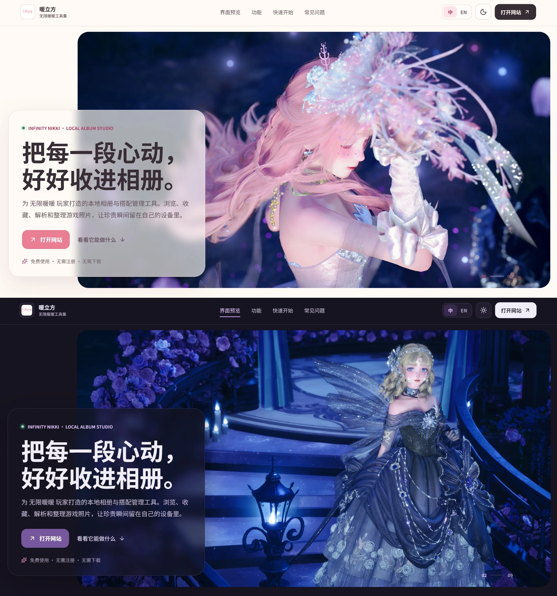
  <p><sub>官网首页：站点介绍、功能一览与界面预览，从这里进入工具集</sub></p>
</div>

### 相册浏览

<div align="center">
  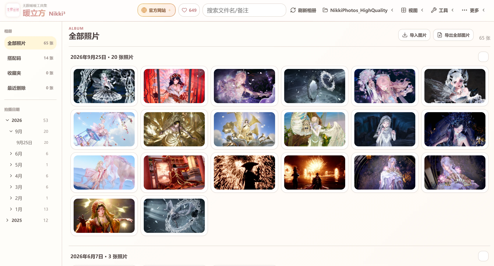
  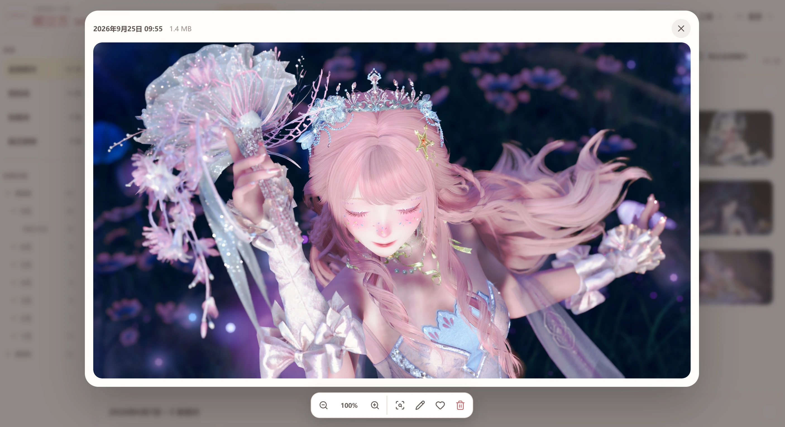
  <p><sub>左 · 主界面：按“年份 &gt; 月份 &gt; 日期”折叠的照片时间轴 ｜ 右 · 大图查看：50%–300% 缩放、拖动与键盘翻页</sub></p>
</div>

### 搭配码

<div align="center">
  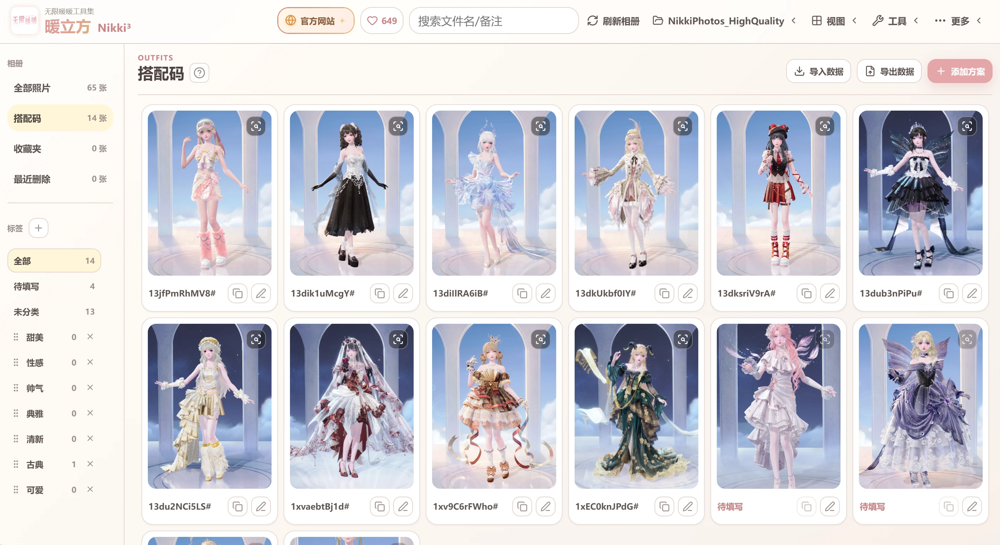
  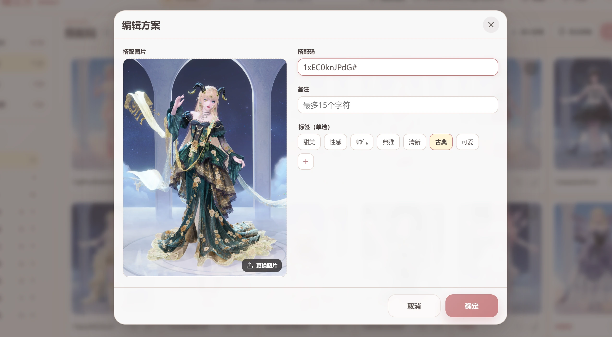
  <p><sub>左 · 搭配码界面：方案列表、标签与待填写方案 ｜ 右 · 搭配码编辑窗口：添加图片、填写搭配码与选择标签</sub></p>
</div>

### 家园方案

<div align="center">
  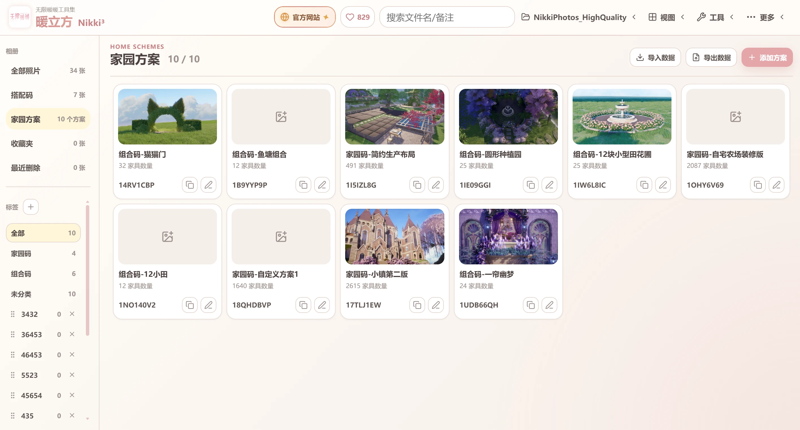
  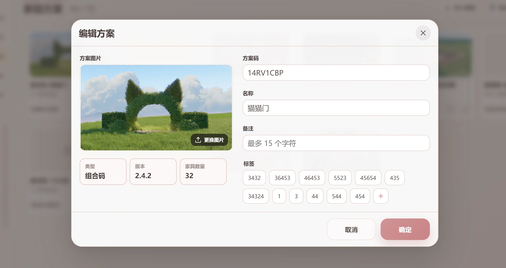
  <p><sub>左 · 家园方案界面：管理家园码、组合码、标签与方案列表 ｜ 右 · 家园方案编辑窗口：填写家园码、组合码与选择标签</sub></p>
</div>

### 解析与清理

<div align="center">
  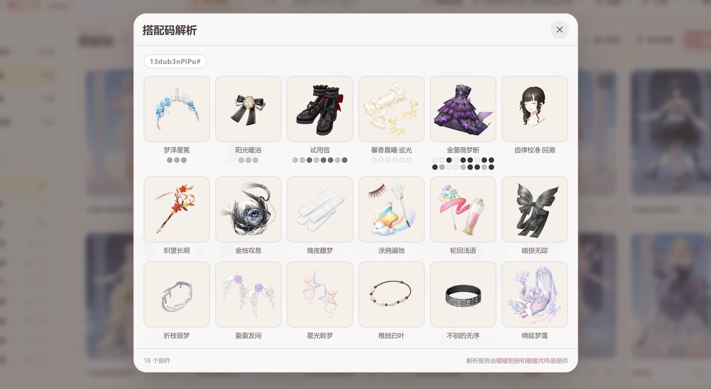
  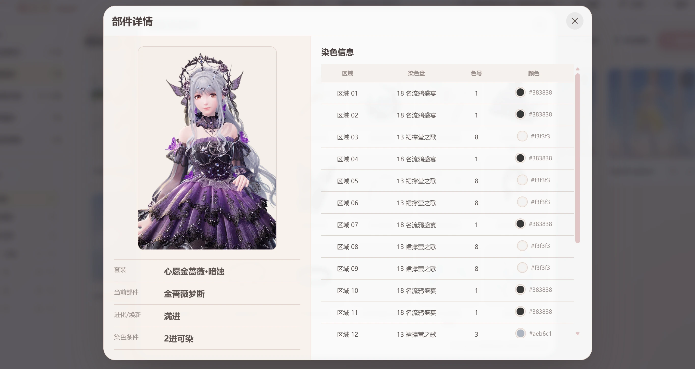
  <p><sub>左 · 搭配码解析：部件与妆容图鉴对照 ｜ 右 · 搭配码部件解析详情：套装、部件与染色信息</sub></p>
</div>

### 小工具

<div align="center">
  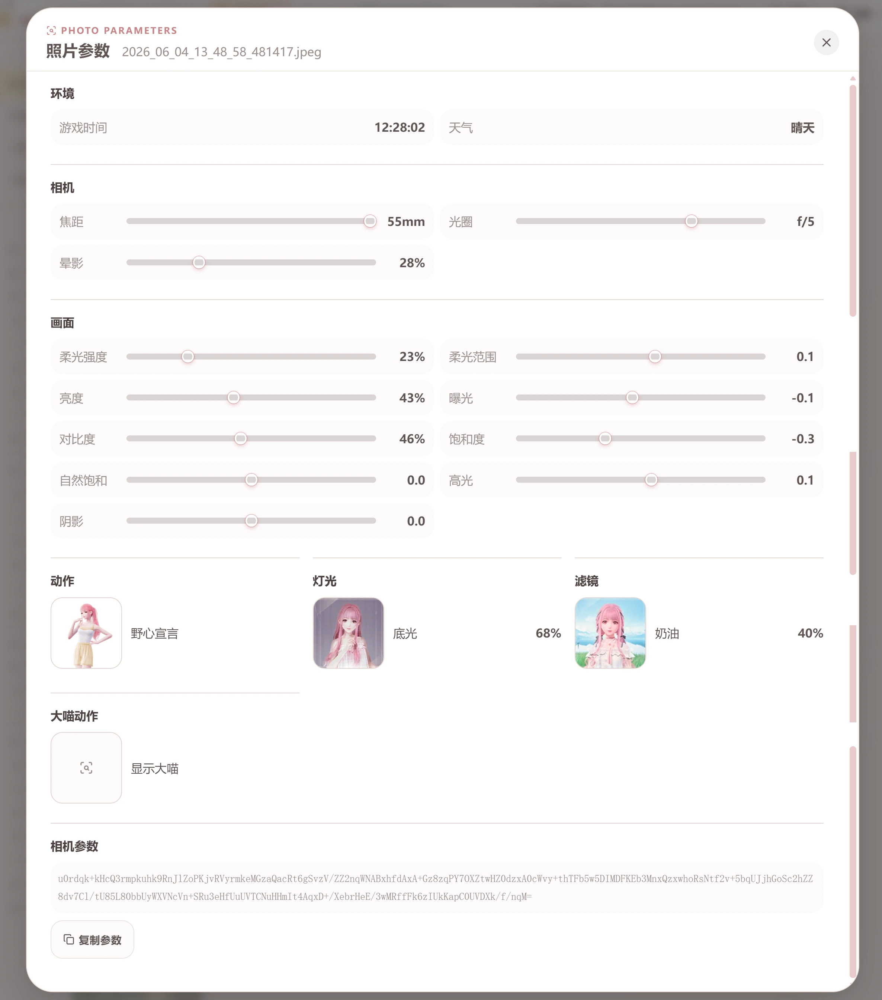
  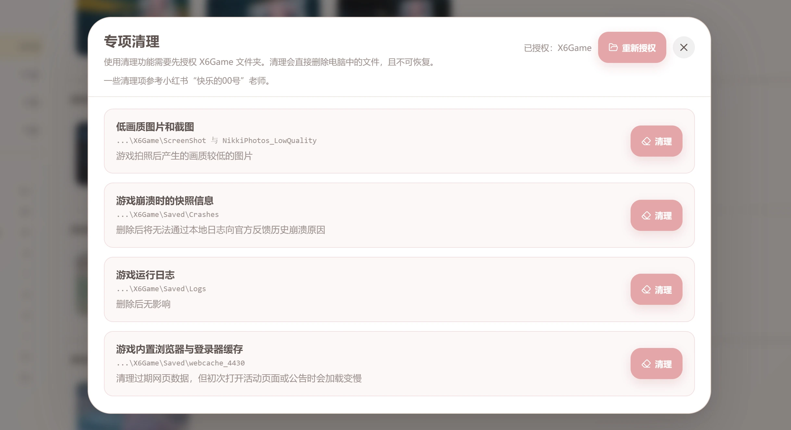
  <p><sub>左 · 照片参数解析：拍摄时间、天气、焦距、光圈、普通动作、灯光与滤镜 ｜ 右 · 专项清理：低画质图片、崩溃快照、运行日志与游戏内置浏览器缓存</sub></p>
</div>


## 功能

### 相册浏览

- 按“年份 > 月份 > 日期”分组，支持折叠时间轴和日期快速跳转。
- 单击选择后从页面底部显示操作栏。
- 双击打开大图预览，支持 50%–300% 缩放、滚轮缩放和放大后拖动。
- 支持键盘翻页和删除当前预览照片。
- 提供 1:1、半尺寸 1:1、16:9、4:3、9:16、3:4 缩略图比例。
- 支持为照片和搭配方案添加最多 15 个字符的备注，并在顶部搜索文件名和备注。
- 相册支持通过文件选择器批量导入图片；标题区可全量导出当前相册，多选底栏可导出选中照片。导出正常完成后，可选择将成功导出的源照片移入最近删除；取消导出会保留已完成目标文件和全部源照片。

### 搭配码与参数解析

- 在本地保存搭配图片、搭配码和标签，支持待填写方案、自动接收图片以及 ZIP 导入导出。
- 搭配码解析结果会在部件名称后显示类型，例如“兽耳轻探-头饰”“部件名-发型”或“部件名-睫毛”。
- 搭配码解析功能参考并使用了[暖暖相册](https://github.com/RanAxro/nikki_albums)和[暖暖共鸣录](https://github.com/dastrokes/gongeo.us-nikki-tracker)的相关项目与数据服务。
- 搭配码解析结果中的部件图片可以点击打开详情浮窗，查看所属套装、套装图片、进化/焕新状态和染色条件；有实际染色时会显示区域、染色盘、色号和颜色。套装详情从暖暖共鸣录公开 API 加载，套装名称、部件关系和染色映射使用随项目提供的目录快照。
- 搭配码解析成功结果会按规范化搭配码持久化到当前浏览器的 IndexedDB，刷新页面后可直接复用，不设置过期时间；“清除缓存”和“清除数据”会删除这些解析缓存。
- 开启“自动解析动作”后，照片动作分类结果也会按照片指纹、解析器版本和动作目录版本保存到当前浏览器的 IndexedDB；只缓存动作分类所需数据，不保存原图或完整参数。解析成功的动作和明确无动作结果会复用缓存，解析失败会在下次授权或补充 UID 后重新尝试。
- 详情浮窗会显示当前部件名；宽屏下左侧摘要固定，较长的染色列表可在右侧独立滚动；窄屏下详情主体整体纵向滚动，染色列表随内容展开。没有实际染色时隐藏染色区域。妆容通过妆容目录关联所属套装；没有所属套装时显示“无”，左侧改为显示当前妆容部件图片。染色条件显示为单一可染阶段，妆容显示“无”。
- 若共鸣录目录没有该部件的套装关系，会明确显示未找到套装，不会用部件名代替套装名；详情加载失败时仍保留原部件解析结果。
- 照片缩略图和大图预览提供参数解析入口；右上角“工具”菜单中的“参数/搭配码解析”窗口集中提供 相机参数和搭配码输入。解析照片会展示拍摄时间、天气、焦距、光圈、晕影、画面调节、普通动作、灯光、滤镜、大喵动作及可导入游戏的相机参数，且菜单中的“参数/搭配码解析”窗口可通过手机访问网站使用。
- 照片参数窗口支持从电脑或手机选择单张本地游戏原图解析；文件只在浏览器内临时读取，不上传服务器，也不会加入相册。已保存 UID 会自动尝试，失败时可手动输入 UID 重试。
- 家园方案页在搭配码下方管理家园码和组合码；输入方案码后会自动解析方案名称、类型、版本和家具数量。方案、用户标签及可选封面保存在当前相册的 `home/` 目录，支持备注、搜索、标签筛选、编辑和删除。
- 家园方案支持 ZIP 备份导入与导出；导出的 ZIP 保存在当前选择的相册文件夹中。输入方案码后，应用优先读取带解析器版本的本地缓存；未命中时通过同源 API 代理请求暖暖相册使用的固定家园方案 CDN，再由项目内 WASM 解析。当前只开放已验证的服务器编号 `49`；WASM 还未解析 `Rid` 和扩展字段，因此界面只展示已可靠提取的字段。清除解析缓存不会删除 `home/` 中的方案、标签或封面。

### 文件清理

- 照片单选或多选后，可在操作栏永久删除 `ScreenShot` 和当前账号 `NikkiPhotos_LowQuality` 中与选中照片同名的图片，当前相册里的选中照片不会被删除。
- 通过右上角“工具”菜单中的“专项清理”窗口清理低画质照片与游戏截图、崩溃快照、运行日志和游戏内置浏览器缓存。

### 小工具与帮助

- 通过右上角“工具”菜单中的“抽卡吉时”查看当前版本抽卡玄学时间表；实际出率仍以游戏概率为准。
- “更新记录”窗口提供当前版本与历史版本更新内容；“使用帮助与介绍”窗口集中展示网站介绍、特色功能、使用教程和注意事项。
- 通过“更多”菜单的“问题反馈”入口直接反馈问题。

## 快速开始

官网入口：https://nikki3.pages.dev/ 。工具集直接打开 https://infinity-nikki-album-manager.pages.dev/ 即可使用，也可通过下载压缩包或 clone 项目来本地运行，点击跳转本地部署教程：[本地安装](#本地安装)。

> 如果国内直连地址临时不可用，可尝试 Vercel 备选地址（需要外网环境）：https://infinity-nikki-album-manager.vercel.app

## 搭配码管理
进入“搭配码”后会显示独立操作指南，请仔细阅读说明。
- 最多可创建 40 个用户标签，每个标签不超过 5 个字符。删除使用中的标签只会让相关方案归入“未分类”。
- 新增标签会显示在标签列表首位；可拖动左侧手柄调整顺序。
- 点击“添加方案”可以选择、拖拽或粘贴图片（点击窗口空白处后按 `Ctrl+V`）；JPG 和 PNG 会在本地转换为 WebP，搭配码允许留空，标签最多选择一个，双击图片可打开预览。
- 搭配卡片右上角始终显示解析按钮；未填写搭配码时按钮保持禁用。删除按钮位于解析按钮左侧，并在悬停卡片或键盘聚焦时显示。
- 可从右上角“工具”菜单打开“参数/搭配码解析”窗口，直接输入搭配码，无需先创建搭配方案；解析结果复用同一个搭配码解析窗口。
- 搭配方案大图预览的底部工具栏会显示当前标签和搭配码，并提供复制与编辑按钮。
- 网站会在当前相册中按需创建 `clothe` 文件夹来管理搭配码。<span style="color: red;">批量导入时可直接把保存好的搭配图片移动进该文件夹，回到网站页面时会自动转为待填写方案。</span>
- 删除过程中如果文件无法完整恢复，网站会弹窗列出相关方案，请手动检查当前相册的 `clothe` 文件夹。
- 使用<span style="color: orange;">自动更新搭配码</span>功能需要授权当前游戏的 `X6Game` 文件夹，可前往页面右上角当前相册下拉菜单进行授权。<span style="color: red;">使用方式是：在游戏内点击分享按钮，需要在搭配截图右下角点击框选按钮，框选完成后点击生成搭配码，再返回网页。网站只有在检测到新搭配码且游戏搭配图片的最后修改时间也已更新时才会导入；已有相同搭配码、图片未更新或找不到图片时会跳过并提示。</span>

<div align="center">
  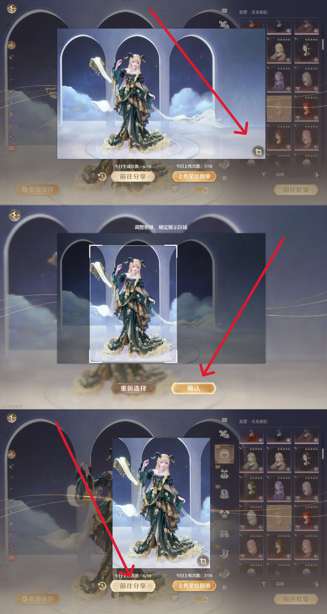
</div>

- “导出数据”会在当前选择的相册文件夹中生成 ZIP 数据文件，并保留搭配码、标签、备注和创建时间。“导入数据”不会覆盖已有方案，重复或无效内容会跳过；导入会先校验完整备份，再分批解压和写入图片，减少大备份占用的浏览器内存。
- JPG、PNG 和 WebP 在保存前只解码校验一次；JPG、PNG 仍会在本地转换为 WebP，整个过程不会上传图片。
- 单击搭配方案可进行多选并显示底部工具栏，<span style="color: red;">搭配方案删除后不可恢复，确认前请核对方案信息。</span>

## 专项清理

点击右上角“工具”菜单中的“专项清理”打开清理窗口，使用清理功能需要授权 `X6Game` 文件夹。

支持以下清理项：

- 低画质图片和截图（`...\X6Game\ScreenShot` 与 `NikkiPhotos_LowQuality`）：游戏拍照后产生的画质较低的图片，仅删除图片文件。存在多个账号文件夹时，可选择清理全部账号或指定账号 ID。如果当前管理的相册本身是 `ScreenShot` 或 `NikkiPhotos_LowQuality`，本次清理会跳过该相册目录、只清理另一个目录，并在确认提示中说明，建议管理 `NikkiPhotos_HighQuality` 相册。
- 游戏崩溃时的快照信息（`...\X6Game\Saved\Crashes`）：删除后将无法通过本地日志向官方反馈历史崩溃原因。
- 游戏运行日志（`...\X6Game\Saved\Logs`）：删除后无影响。
- 游戏内置浏览器与登录器缓存（`...\X6Game\Saved\webcache_4430`）：清理过期网页数据，但初次打开活动页面或公告时会加载变慢。

## 选择相册

点击“选择/恢复相册路径”，推荐直接选择：

```text
...\InfinityNikki Launcher\InfinityNikki\X6Game\Saved\GamePlayPhotos\你的ID\NikkiPhotos_HighQuality
```

不要选择 C 盘、Program Files、游戏安装根目录等受保护或过大的上级目录。

## 常用操作

| 操作 | 结果 |
| --- | --- |
| 单击照片 | 选中或取消选中 |
| 双击照片 | 打开大图预览 |
| 点击爱心 | 加入或移出收藏夹 |
| 点击左侧日期 | 跳转到对应日期 |
| 左右方向键 | 在大图预览中切换照片 |
| 滚轮 / 缩放按钮 | 在大图预览中按 25% 步长缩放 |
| 拖动大图 | 放大后移动图片查看细节 |
| `Esc` | 关闭大图预览 |
| `Delete` | 将当前预览照片移到最近删除 |
| 底部操作栏 | 全选、批量收藏、删除、恢复或永久删除 |
| 导入图片 | 选择多张本地图片并复制到当前相册 |
| 导出全部图片 | 将当前相册全部图片复制到指定文件夹并显示进度 |
| 底栏导出 | 将选中的图片复制到指定文件夹 |

> 普通相册删除会把原图移动到当前相册的 `trash` 文件夹；<span style="color: red;">最近删除中的“永久删除”和“专项清理”会直接删除电脑文件，无法恢复。</span>

## 最近删除与刷新

- 点击“刷新相册”可立即同步文件夹；页面重新获得焦点时也会自动同步，并提示新增或外部移除的照片。
- 最近删除按删除时间排序，顶部显示照片总数和总大小；支持单张或批量恢复、永久删除、全选、大图预览和清空全部。
- 恢复时若原相册已有同名文件，会自动使用 `_restored_1`、`_restored_2` 等后缀，不会覆盖现有照片。
- 最近删除不会自动过期，会一直保留到手动恢复或永久删除。


## 常见问题

### 启动器没有反应

- 确认项目已经完整解压，不要在 ZIP 内运行。
- 确认已安装 Node.js LTS，且 `start` 文件夹没有缺失。
- 检查安全软件是否拦截 EXE 或 BAT 文件。
- 也可直接运行 `start\Start-Remote-D1-Website.bat` 查看错误信息。

### 网页没有显示照片

- 确认选择的是实际图片目录。
- 确认文件扩展名受支持；文件名以日期格式开头时会优先按文件名整理，其他图片会按文件最后修改时间显示。
- 浏览器授权失效时，重新点击“选择/恢复相册路径”。

### 浏览器拒绝打开文件夹

浏览器会阻止网页访问系统目录。请直接选择 `NikkiPhotos_HighQuality`，<span style="color: red;">不要选择磁盘根目录或游戏安装上级目录。</span>

## 隐私与安全

- 照片在本地浏览器中读取。
- 照片尾段、账号密钥派生、AES 解密和 CameraParams 解析均在本地 WASM 中执行，照片和解析结果不会上传。
- 相册目录授权、收藏记录、搭配码、家园方案码和照片动作解析缓存保存在当前浏览器本地；“更多”里的“清除缓存”会清除这三类解析缓存，不影响其他授权或设置，也不会删除 `home/` 中已保存的方案和标签。“清除数据”会二次确认后清除全部网站本地记录和授权，让网站回到首次打开状态。
- 浏览器可能因安全策略要求重新授权文件夹。
- 删除和专项清理会修改电脑中的真实文件；“清除缓存”和“清除数据”不会删除电脑里的文件。

## 本地安装


环境要求：Windows、[Node.js LTS](https://nodejs.org/)、电脑上的最新版 Chrome、Edge 或其他兼容的 Chromium 浏览器。

### 安装 Node.js

1. 打开 [Node.js 官网](https://nodejs.org/)，下载标有 **LTS** 的 Windows 安装包，不要选择 Current 版本。
2. 双击安装包，保持默认选项并继续安装；确保 `Add to PATH` 相关选项没有被取消。
3. 安装完成后关闭并重新打开终端、项目文件夹和启动器窗口，让环境变量生效。
4. 按 `Win + R`，输入 `cmd` 并回车，然后分别运行：

```bash
node -v
npm -v
```

两个命令都能显示版本号，说明安装成功。如果提示“不是内部或外部命令”，请重启电脑后再试；仍然失败时，卸载 Node.js 并重新安装 LTS 版本。

### 本地部署

1. 从 [GitHub Releases](https://github.com/sumopenny/Infinity-Nikki-Album-Manager/releases) 或 [Gitee Releases](https://gitee.com/sumopenny/Infinity-Nikki-Album-Manager/releases) 下载并解压项目，或从仓库克隆源码。
2. 双击根目录的 `网站启动器.exe`。
3. 首次运行会自动安装依赖并打开 `http://localhost:5173`。
4. 使用期间不要关闭窗口。

启动器不可用时，可双击 `start\Start-Remote-D1-Website.bat`，或使用下方开发命令手动启动。根目录的 `网站启动器.exe` 也会连接这个远程 D1 启动脚本。

如果希望本地页面直接读取线上 D1 数据，请双击 `start\Start-Remote-D1-Website.bat`。点赞等 D1 请求会在本地转发到线上 Pages，不会让浏览器直接接触 D1；搭配码、家园方案数据和 Gongeo 图鉴详情由本地 Vite 直接代理到上游服务。生产部署通过 `functions/api/gongeo/[[path]].ts` 和 `functions/api/home-build/[key].ts` 提供同源数据代理。点击点赞会真实写入线上数据库，请谨慎使用。脚本默认使用 `https://infinity-nikki-album-manager.pages.dev`，也可把其他 Pages 地址作为脚本参数传入。

### 开发命令

```bash
npm install       # 安装依赖
npm run dev       # 启动前更新动作、中英文部件目录和共鸣录映射目录，再启动开发服务器
set REMOTE_API_ORIGIN=https://infinity-nikki-album-manager.pages.dev
npm run dev:remote # 更新动作、部件目录和共鸣录映射目录；搭配码和家园方案走对象存储代理，其余 /api 走线上 Pages
npm test          # 运行自动化测试
npm run build     # 类型检查并构建
npm run build:cloudflare # 刷新普通动作、部件目录和共鸣录映射目录后构建
npm run preview   # 预览构建结果
```

技术栈：Vue 3、TypeScript、Vite、File System Access API、IndexedDB。

---

## 致谢与许可证

部分功能借鉴了 [暖暖相册](https://github.com/RanAxro/nikki_albums) 和 [共鸣录](https://github.com/dastrokes/gongeo.us-nikki-tracker)。项目中随附的共鸣录目录快照遵循其 MIT 许可证；本项目许可证请参阅根目录的 [LICENSE](LICENSE) 文件。
