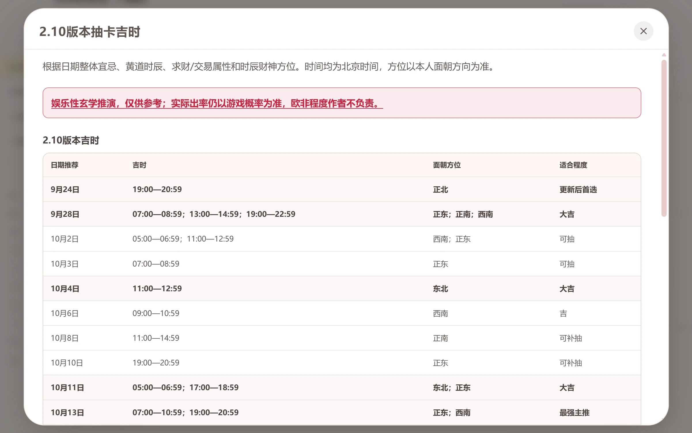

# NikkiCube

<div align="center">
  
  <p><strong>Nikki³ · Infinity Nikki Toolkit</strong></p>
  <p>NikkiCube runs locally in your browser to manage albums, outfit codes, photo parameters, and targeted cleanup.</p>
  <p style="color: orange;">If you run into any issues, please fill out the survey in the site's Feedback section, or report them through GitHub/Gitee Issues or the author's social platforms.</p>
  <p>
    <a href="https://github.com/sumopenny/Infinity-Nikki-Album-Manager/releases">GitHub Releases</a> ·
    <a href="https://gitee.com/sumopenny/Infinity-Nikki-Album-Manager/releases">Gitee Releases</a> ·
    <a href="https://github.com/sumopenny/Infinity-Nikki-Album-Manager">GitHub</a> ·
    <a href="https://gitee.com/sumopenny/Infinity-Nikki-Album-Manager">Gitee</a>
  </p>
  <p><a href="README.md"><strong>简体中文</strong></a></p>
</div>

---
### Official site: https://nikki3.pages.dev/

### Use it online (toolkit): https://infinity-nikki-album-manager.pages.dev/

> Toolkit Vercel fallback (VPN may be required): https://infinity-nikki-album-manager.vercel.app
>
> For local deployment, download the archive or clone the project. Jump to the local deployment guide: [Local Setup for Developers](#local-setup-for-developers)

---
## Website and UI

<div align="center">
  
  <p><sub>Official home page: site overview, feature list, and UI previews, with the entry into the toolkit</sub></p>
</div>

### Browsing the album

<div align="center">
  
  
  <p><sub>Left · Main interface: photo timeline grouped by year / month / day ｜ Right · Large preview: 50%–300% zoom, pan, and keyboard paging</sub></p>
</div>

### Outfit codes

<div align="center">
  
  
  <p><sub>Left · Outfit codes: plan list, tags, and pending plans ｜ Right · Outfit editor: add an image, enter a code, and pick a tag</sub></p>
</div>

### Parsing and cleanup

<div align="center">
  
  
  <p><sub>Left · Outfit code parsing: item and makeup catalog lookup ｜ Right · Special cleanup: low-quality images, crash snapshots, runtime logs, and the game's built-in browser cache</sub></p>
</div>

### Small tools

<div align="center">
  
  
  <p><sub>Left · Photo parameter parsing: capture time, weather, focal length, aperture, normal poses, lights, and filters ｜ Right · Lucky pull times: the current version table, for entertainment only</sub></p>
</div>


## Features

### Browsing the album

- Group photos by year, month, and date with a collapsible timeline and quick date jumps.
- Single-click to select a photo and show the bottom action bar.
- Double-click to open the large preview with 50%–300% zoom, mouse-wheel zooming, and drag-to-pan after zooming in.
- Use the keyboard to navigate photos and delete the current preview photo.
- Choose 1:1, Half 1:1, 16:9, 4:3, 9:16, or 3:4 thumbnail ratios.
- Add notes of up to 15 characters to photos and outfit plans, then search the current view by file name, note, or outfit code.
- The album supports batch image import through the file picker. The gallery header exports all photos, while the selection bar exports only selected photos. After a successful export, you can choose to move successfully exported source photos to Recently Deleted. Cancelling keeps completed target files and all source photos.

### Outfit codes and parameter parsing

- Store outfit images, outfit codes, and tags locally, with pending plans, automatic image intake, and ZIP import/export.
- Outfit-code results append the item type to each name, such as “Item-Hair”, “Item-Hair Accessories”, or “Item-Eyelashes”.
- The outfit-code decoder references and uses related projects and data services from [Nikki Albums](https://github.com/RanAxro/nikki_albums) and [Nikki Tracker](https://github.com/dastrokes/gongeo.us-nikki-tracker).
- Clicking an item image opens a detail dialog with the current item, outfit, evolution or Glow-Up state, and dye condition. On wide screens, the left summary stays fixed while long dye lists scroll independently on the right. On narrow screens, the detail content scrolls vertically as a whole and the dye list expands with it. The dye area is hidden when the decoded item has no dyes, and makeup outfit relations are restored through the makeup catalog.
- Successful outfit-code results are persisted in the current browser's IndexedDB by normalized code, so they can be reused after a page refresh with no expiration; Clear cache and Clear data remove these parse results.
- Parse CameraParams from photo thumbnails or the full-size viewer. The upper-right Tools menu opens a shared Parameter / outfit-code parser window for direct camera-parameter and outfit-code input. Photo parsing shows capture time, weather, focal length, aperture, vignette, image adjustments, normal poses, lights, filters, Momo poses, and camera parameters that can be imported into the game. The Parameter / outfit-code parser window in the Tools menu can also be used on mobile devices.
- The photo-parameter window can parse one local original game image selected on a computer or phone. The file is read temporarily in the browser only: it is not uploaded or added to the album. Saved UIDs are tried automatically, with manual UID retry when needed.
- The Home Schemes view below Outfit Codes manages home and combo codes. Entering a code automatically parses the scheme name, type, version, and furniture count. Schemes, user tags, and optional covers are stored in the current album's `home/` directory, with notes, search, tag filters, editing, and deletion.
- Home schemes support ZIP backup import and export; exported ZIP files are saved in the currently selected album folder. Scheme codes first use a local parser-versioned cache. On a miss, a same-origin API proxy requests the fixed Home Build CDN used by Infinity Nikki Album, and the bundled WASM parses the response. Only verified server ID `49` is enabled. `Rid` and extension fields are not yet decoded, so the UI only shows fields that can be extracted reliably. Clearing parse cache does not remove schemes, tags, or covers in `home/`.

### File cleanup

- Deleted high-quality photos move to the current album's `trash` folder for preview, restore, or permanent deletion.
- After selecting one or more photos, use the selection bar to permanently delete same-name images from `ScreenShot` and the current account's `NikkiPhotos_LowQuality` folder. The action requires confirmation and cannot be undone; selected photos in the current album are never deleted.
- Open Special Cleanup from the upper-right Tools menu to clean low-quality photos and game screenshots, crash snapshots, runtime logs, and the game's built-in browser cache.

### Tools and help

- Open Lucky pull times from the upper-right Tools menu to view the entertainment-only Version 2.10 timing table; actual drop rates still follow the game's probabilities.
- The Release history window shows the current release and historical release notes; Help and introduction contains the site overview, features, tutorials, and important notes.
- The Release history window opens automatically when the site loads; check "Don't show again" to hide it until the next version update.
- Report issues directly through the Feedback entry in the More menu.

## Quick Start

Official site: https://nikki3.pages.dev/. Open https://infinity-nikki-album-manager.pages.dev/ directly to use the toolkit. You can also download the archive or clone the project to run it locally. Jump to the local deployment guide: [Local Setup for Developers](#local-setup-for-developers).

> If the China-accessible site is temporarily unavailable, try the Vercel fallback (VPN required): https://infinity-nikki-album-manager.vercel.app

## Outfit Code Management
Entering Outfit codes opens a standalone guide. Please read it carefully.
- You can create up to 40 user tags, and each tag can contain up to 5 characters. Deleting a tag in use only moves related plans to Uncategorized.
- New tags appear at the top of the tag list; drag the left handle to adjust the order.
- Click Add outfit to select, drag and drop, or paste an image (click an empty area in the dialog and press `Ctrl+V`). JPG and PNG files are converted locally to WebP, the outfit code can be empty, each plan can use one tag, and double-clicking the image opens the preview.
- The decode button is always visible in the upper-right corner of each outfit card and remains disabled until a code is entered. The delete button sits to its left and appears when the card is hovered or the button receives keyboard focus.
- Click a decoded item image to open its details dialog with the related outfit, outfit image, evolution/glow-up status, and dye conditions. Items with decoded dye data also show the area, palette, color slot, and color. Outfit details load from the public Nikki Tracker API; outfit names, item relations, and dye mappings use the bundled catalog snapshot.
- When a makeup part has no related outfit, the outfit field shows "None" and the left image falls back to the current makeup-part image. Decoded item results remain available if detail loading fails.
- Open the shared Parameter / outfit-code parser from the upper-right Tools menu and enter a code without creating a plan first; results open in the same decoder dialog.
- The outfit preview toolbar shows the current tag and outfit code, with Copy and Edit buttons.
- The app creates a `clothe` folder inside the current album as needed to manage outfit codes. <span style="color: red;">For bulk import, move saved outfit images directly into this folder; opening, refreshing, or refocusing the website page automatically converts them into pending plans.</span>
- If a delete operation cannot fully restore files, the app lists the affected outfits in a dialog; manually inspect the current album's `clothe` folder.
- Using the <span style="color: orange;">auto update outfit code</span> feature requires authorizing the current game's `X6Game` folder. You can authorize it from the Current album menu in the upper-right corner. <span style="color: red;">How to use: in the game, tap Share, tap the selection button at the lower-right corner of the outfit screenshot, tap Generate Outfit Code after the selection is complete, then return to the web page. The website imports only when both the outfit code is new and the game's outfit image has a newer last-modified time; existing codes, unchanged images, or missing images are skipped with a status message.</span>

<div align="center">
  
</div>

- Export data generates a ZIP file in the currently selected album folder and preserves outfit codes, tags, notes, and creation times. Import data validates and merges the ZIP without replacing existing plans; duplicate or invalid content is skipped. Imports validate the complete backup first, then extract and write images in bounded batches to reduce browser memory use with large backups. <span style="color: red;">Deleting an outfit plan is permanent and does not go to Recently Deleted.</span>
- JPG, PNG, and WebP sources are decoded for validation only once before saving. JPG and PNG files are still converted locally to WebP, and images are never uploaded.
- The album supports batch image import through the file picker. The gallery header exports all photos, while the selection bar exports only selected photos. After a successful export, you can choose to move successfully exported source photos to Recently Deleted. Cancelling keeps completed target files and all source photos.
- Single-click outfit plans to select multiple items and show the bottom toolbar. <span style="color: red;">Deleted outfit plans cannot be restored, so check the plan information before confirming.</span>

## Special Cleanup

Open Special Cleanup from the upper-right Tools menu to open the cleanup window. Using the cleanup features requires authorizing the `X6Game` folder.

The following cleanup items are available:

- Low-quality photos and screenshots (`...\X6Game\ScreenShot` and `NikkiPhotos_LowQuality`): lower-quality images produced by in-game photography; only image files are deleted. When multiple account folders exist, you can choose to clean all accounts or a specific account ID. If the album you are currently managing is itself `ScreenShot` or `NikkiPhotos_LowQuality`, the cleanup skips that album folder and only cleans the other one, with a note in the confirmation prompt; managing the `NikkiPhotos_HighQuality` album is recommended.
- Crash snapshots (`...\X6Game\Saved\Crashes`): after deletion, historical crash causes can no longer be reported to the official team via local logs.
- Runtime logs (`...\X6Game\Saved\Logs`): deleting them has no side effects.
- Built-in browser and login cache (`...\X6Game\Saved\webcache_4430`): clears expired web data, but event pages and announcements load more slowly the first time they are opened afterwards.

## Choose an Album

Click `Choose / restore album folder`; it is recommended to select:

```text
...\InfinityNikki Launcher\InfinityNikki\X6Game\Saved\GamePlayPhotos\Your ID\NikkiPhotos_HighQuality
```

Do not select drive roots, Windows, Program Files, the game install root, or other protected or overly broad parent directories.

## Controls

| Action | Result |
| --- | --- |
| Single-click photo | Select or unselect |
| Double-click photo | Open large preview |
| Click the heart | Add to or remove from Favorites |
| Click a sidebar date | Jump to that date |
| Left / Right Arrow | Switch photos in large preview |
| Mouse wheel / zoom buttons | Zoom the large preview in 25% steps |
| Drag the large preview | Move the image after zooming in to view details |
| `Esc` | Close the large preview |
| `Delete` | Move the current preview photo to Recently Deleted |
| Bottom action bar | Select all, batch favorite, delete, restore, or permanently delete |
| Import photos | Choose multiple local image files and copy them into the current album |
| Export all photos | Copy every photo to a selected folder with a progress window |
| Selection bar Export | Copy only the selected photos to a selected folder |

> Normal album deletion moves the original file to the current album's `trash` folder; <span style="color: red;">Permanent deletion in Recently Deleted and Special Cleanup directly delete files from your computer and cannot be restored.</span>

## Recently Deleted and Refresh

- Click Refresh album to sync the folder immediately; the page also syncs when it regains focus and reports newly added or externally removed photos.
- Recently Deleted is sorted by deletion time, with total photo count and total size shown at the top.
- Supports single or batch restore, permanent deletion, select all, large preview, and permanently clearing everything.
- Recently Deleted photos do not expire automatically and remain until restored or manually permanently deleted.


## FAQ

### The launcher does nothing

- Make sure the project has been fully extracted, and do not run it inside the ZIP.
- Make sure Node.js LTS is installed and the `start` folder is not missing.
- Check whether security software blocked the EXE or BAT file.
- You can also run `start\Start-Remote-D1-Website.bat` directly to view error details.

### No photos are displayed

- Make sure you selected the actual image folder.
- Make sure the file extension is supported. Photos whose filenames start with a date use that date; other photos use the file's last modified time.
- If browser authorization expires, click Choose / restore album folder again.

### The browser refuses to open a folder

Browsers block web pages from accessing system folders. Please select `NikkiPhotos_HighQuality` directly, and <span style="color: red;">do not select the drive root or a high-level game install directory.</span>

## Privacy and Safety

- Photos are read locally in your browser.
- Photo-tail extraction, account-key derivation, AES decryption, and CameraParams parsing run locally inside WASM; photos and parsed results are not uploaded.
- Album folder authorization, Favorites, and outfit-code and home-scheme-code parse results are stored locally in the current browser; Clear cache in More only clears these two parse caches and does not affect other authorizations or settings or delete saved schemes and tags in `home/`. Clear data asks for confirmation twice, then clears all website local records and authorizations so the website returns to first-open state.
- Browser security policies may require folder authorization again.
- Delete and Special Cleanup modify real files on your computer; Clear cache and Clear data do not delete real photos, `clothe`, `trash`, or other files on your computer.

## Local Setup for Developers

Most users should use the online version first. Download the project only when you need to study the code, customize it, or debug it locally.

Requirements: Windows, [Node.js LTS](https://nodejs.org/), and the latest desktop version of Chrome, Edge, or another compatible Chromium browser.

### Install Node.js

1. Open the [Node.js website](https://nodejs.org/), download the Windows installer marked **LTS**, and do not choose the Current version.
2. Run the installer with the default options, and make sure the `Add to PATH` option is not disabled.
3. After installation, close and reopen terminals, project folders, and launcher windows so the environment variables take effect.
4. Press `Win + R`, enter `cmd`, and run:

```bash
node -v
npm -v
```

Both commands should print version numbers, which means installation succeeded. If Windows says the command is not recognized, restart the computer and try again; if it still fails, uninstall Node.js and reinstall the LTS version.

### Study Code or Run Locally

1. Download and extract the project from [GitHub Releases](https://github.com/sumopenny/Infinity-Nikki-Album-Manager/releases) or [Gitee Releases](https://gitee.com/sumopenny/Infinity-Nikki-Album-Manager/releases), or clone the source repository.
2. Double-click `网站启动器.exe` in the project root.
3. On first run, dependencies are installed automatically and `http://localhost:5173` opens.
4. Keep the window open while using it.

If the launcher is unavailable, double-click `start\Start-Remote-D1-Website.bat`, or use the development commands below to start manually. The root `网站启动器.exe` also uses this remote D1 launcher.

To run the local site against the online D1 data, double-click `start\Start-Remote-D1-Website.bat`. The local server proxies outfit-code data, home-scheme data, and Gongeo catalog details directly to their upstream services; D1 requests such as likes go to the deployed Pages API, so the browser never receives D1 credentials. Production deployments expose same-origin data proxies at `functions/api/gongeo/[[path]].ts` and `functions/api/home-build/[key].ts`. Like actions from this local site write to the online database; use this launcher carefully. The script defaults to `https://infinity-nikki-album-manager.pages.dev`, and accepts another Pages URL as its first argument.

### Development Commands

```bash
npm install       # Install dependencies
npm run dev       # Refresh poses, bilingual item catalogs, and Gongeo mapping catalogs before starting the dev server
set REMOTE_API_ORIGIN=https://infinity-nikki-album-manager.pages.dev
npm run dev:remote # Refresh poses, item catalogs, and Gongeo mappings; proxy outfit and home-scheme data to storage and other /api calls to Pages
npm test          # Run automated tests
npm run build     # Type-check and build
npm run build:cloudflare # Refresh normal poses, item catalogs, and Gongeo mappings, then build
npm run preview   # Preview the build result
```

Stack: Vue 3, TypeScript, Vite, File System Access API, IndexedDB.

---

## Acknowledgements and License

Some features were inspired by [Nikki Albums](https://github.com/RanAxro/nikki_albums) and [Gongeo.us Nikki Tracker](https://github.com/dastrokes/gongeo.us-nikki-tracker). The bundled Gongeo.us catalog snapshot is distributed under its MIT license; see the root [LICENSE](LICENSE) file for this project's license.
